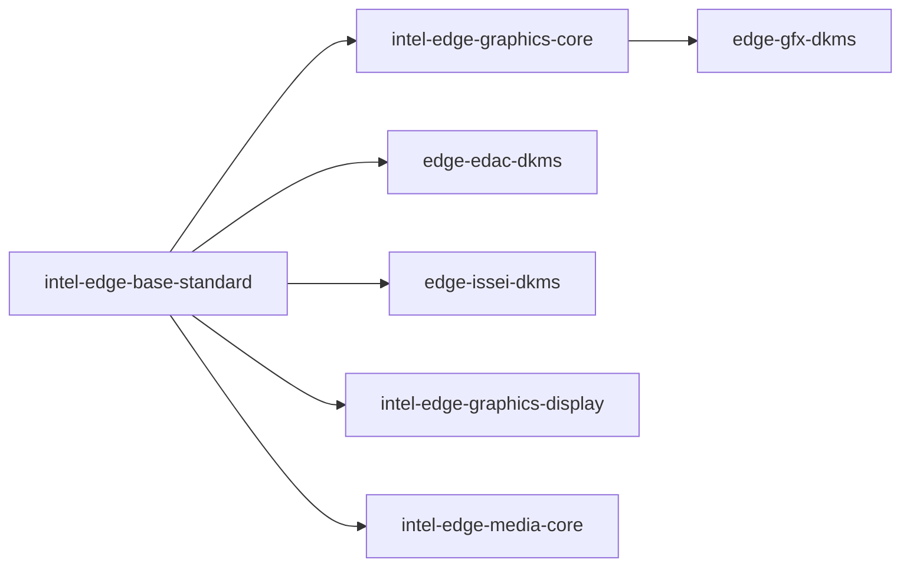

# ADR: Integrate EdgePack into ICT OS Image Composer

**Status**: Proposed
**Date**: 2026-09-08
**Updated**: 2026-09-08 — Integrating EdgePack & Secure Boot into ICT
**Authors**: ICT Team
**Technical Area**: OS image composition, Ubuntu packaging, kernel modules, DKMS

---

## Summary

Integrate EdgePack into ICT images as an APT-managed package set layered on a
validated Ubuntu release, architecture, and kernel ABI. The base package for
this integration is `intel-edge-base-standard`. For the initial image,
ICT will build and install all required EdgePack DKMS modules
**during composition** for the image's **explicit target kernel**, not
implicitly for the composer's running kernel. First boot will verify and load
the already-built modules; it will not normally compile them.

The image manifest must resolve the exact target kernel release before the
EdgePack package transaction and DKMS build occur. All DKMS operations during
composition must use that target explicitly (for example,
`dkms build ... -k <target-kernel>`), and package hooks must not rely on
`uname -r` inside the chroot.

The composed image may retain DKMS, the EdgePack module source under
`/usr/src`, the required build infrastructure, and, when the selected Secure
Boot policy permits it, a protected module-signing key and certificate. On a
subsequent supported Ubuntu HWE upgrade, APT and DKMS can build the matching,
lock-step EdgePack release for the new kernel on the target system and sign the
resulting modules using the provisioned signing identity. EdgePack publication
and validation will follow Canonical's Ubuntu and HWE release cadence.

---

## Context

### Problem Statement

EdgePack provides Intel drivers and userspace components that are not included
in the base Ubuntu distribution. Installing `intel-edge-base-standard` pulls
both userspace packages and source-based DKMS packages. In a running Ubuntu
system, Debian maintainer scripts commonly build these modules for `uname -r`.
That assumption is unsafe in an image-composition chroot: `uname -r` reports
the composer host kernel, which may differ from the kernel installed in the
image and may come from a different Ubuntu release.

The integration must therefore define:

- The supported Ubuntu, kernel, platform, and EdgePack combinations
- The package dependency graph and repository inputs
- Which dependencies exist only during composition and which remain in the
  image
- Whether modules are built during composition or on first boot
- How future HWE upgrades trigger a compatible EdgePack and module rebuild
- How build, signing, and module-validation failures are surfaced

### Background

EdgePack is an APT layer on top of Ubuntu. The current manifest supports Panther
Lake (`ptl`) and Wildcat Lake (`wcl`) platforms. The validated OS targets for
this integration are:

| Ubuntu target | Validated release | Kernel target | Policy |
| --- | --- | --- | --- |
| Ubuntu 24.04 LTS | 24.04.5 | EdgePack 7.0 kernel line | Install only the EdgePack build validated for the exact HWE kernel ABI. |
| Ubuntu 26.04 | 26.04 | EdgePack 7.0 kernel line | Install only the EdgePack build validated for the exact Ubuntu kernel ABI. |

`7.0` is a product/kernel line, not a promise that one binary module works
with every kernel whose version is greater than or equal to 7.0. The release
manifest must identify an exact Ubuntu suite, architecture, kernel release/ABI,
EdgePack repository snapshot, and package versions. Community or custom kernels
are outside the validated matrix.

The current Noble package breakdown is:

| EdgePack package | Role | Important direct dependencies |
| --- | --- | --- |
| `intel-edge-base-standard` | Base non-realtime metapackage | `intel-edge-graphics-core`, `intel-edge-graphics-display`, `intel-edge-media-core`, `linux-firmware`, `edge-edac-dkms`, `edge-issei-dkms` |
| `intel-edge-graphics-core` | Headless/core graphics userspace and driver | Mesa, `libdrm2`, `edge-gfx-dkms` |
| `intel-edge-graphics-display` | Wayland, Mutter, Weston, and Xorg display stack | `intel-edge-graphics-core` and display-server packages |
| `intel-edge-media-core` | VA-API, oneVPL, and media runtime | Graphics core/display, Intel media driver, VA-API, oneVPL |
| `intel-edge-media-ffmpeg` | Optional FFmpeg profile | `intel-edge-media-core` and FFmpeg runtime/development packages |
| `intel-edge-media-gst` | Optional GStreamer profile | `intel-edge-media-core` and GStreamer plugin/runtime/development packages |
| `intel-edge-npu` | Optional NPU profile | NPU compiler, firmware, Level Zero NPU runtime; Noble also requires the configured Intel graphics snapshot repository |
| `intel-edge-manageability` | Optional vPRO manageability profile | `lms`, `rpc-go`, `edge-mei-dkms` |

The base graphics dependency chain is:



The three base DKMS packages contain source rather than prebuilt `.ko` files:

| DKMS package | Source location | Modules produced | Destination |
| --- | --- | --- | --- |
| `edge-gfx-dkms` | `/usr/src/edge-gfx-dkms-7.0` | `xe.ko`, `virtio-gpu.ko` | `/lib/modules/<kernel>/updates/dkms` |
| `edge-edac-dkms` | `/usr/src/edge-edac-dkms-7.0` | `igen6_edac.ko` | `/lib/modules/<kernel>/updates/dkms` |
| `edge-issei-dkms` | `/usr/src/edge-issei-dkms-7.0` | `issei.ko`, `issei-heci.ko` | `/lib/modules/<kernel>/updates/dkms` |

For example, `edge-gfx-dkms` contains a `dkms.conf` that invokes the target
kernel build system through `/lib/modules/${kernelver}/build`, builds `xe` and
`virtio-gpu`, installs them under `/updates/dkms`, and sets
`AUTOINSTALL="yes"`. Its Debian `postinst` currently performs:

```bash
dkms add -m edge-gfx-dkms -v 7.0
dkms build -m edge-gfx-dkms -v 7.0 -k "$(uname -r)"
dkms install -m edge-gfx-dkms -v 7.0 -k "$(uname -r)"
```

The EDAC and ISSEI packages follow the same pattern. This behavior is suitable
for installation on a running target but does not identify the correct image
kernel inside a chroot. A chroot changes userspace, not the kernel: `uname -r`
remains the composer host's kernel.

---

## Decision / Recommendation

ICT will build EdgePack DKMS modules **during image composition**
for the exact kernel installed in the image. The normal first boot path will
not compile modules. The build will run inside the target Ubuntu chroot,
because that keeps the compiler, package database, filesystem layout, and DKMS
state aligned with the delivered root filesystem.

The composition pipeline will:

1. Resolve a release manifest that pins the Ubuntu suite, architecture, exact
  target kernel package/release/flavour, EdgePack repository snapshot, and
  package versions.
2. Install the target `linux-image-<target-kernel>` and matching exact
  `linux-headers-<target-kernel>` into the image root. A generic headers
  metapackage is insufficient unless it is verified to resolve to that exact
  release.
3. Install the common DKMS build infrastructure and any module-specific
  dependencies listed in the release manifest.
4. Install `intel-edge-base-standard` and selected optional EdgePack profiles
  into the target root.
5. Ensure package maintainer scripts do not compile for the composer kernel.
  EdgePack packages must either accept a composer-supplied target kernel and
  use it for all DKMS operations, or defer compilation until ICT invokes the
  explicit target-kernel build. ICT must not treat a package transaction as
  proof that DKMS succeeded.
6. Explicitly run `dkms add` if necessary, then run the following for every
  expected module/version:

  ```text
  dkms build -k <target-kernel>
  dkms install -k <target-kernel>
  ```

  The commands must resolve `/lib/modules/<target-kernel>/build` inside the
  target root; the host's headers and `/lib/modules` must never be used.
7. Run `depmod -a <target-kernel>`, apply the configured module-signing policy,
  and regenerate the target kernel's initramfs if the modules are required
  during early boot.
8. Verify every expected `.ko` exists, has the intended signature and
  `vermagic`, is registered as installed by `dkms status`, and is resolvable
  with `modinfo -k <target-kernel>` from the image root.
9. Fail composition if any expected module is absent, built for the wrong
  kernel, unsigned under the selected Secure Boot policy, or reported failed
  by DKMS.

The current package scripts require correction or a narrowly scoped integration
workaround before relying on this flow:

- Their `postinst` scripts append `|| true` to `dkms add`, `build`, and
  `install`, allowing package configuration to succeed after a failed module
  build. Composer validation must be authoritative, and future packages should
  propagate these failures.
- Their `PRE_BUILD` checks fall back to `uname -r` because DKMS does not export
  `kernelver` to hook scripts. The package hook must receive the target kernel
  explicitly, or the composer must perform equivalent configuration checks
  against `/lib/modules/<target-kernel>/build` before invoking DKMS. ICT must
  not fake `uname`, bind the host's `/lib/modules`, or copy host-built modules
  into the image.

The preferred long-term package contract is that DKMS package configuration
succeeds without requiring the running kernel to be the target kernel, explicit
target-kernel builds return failures, and expected modules, kernel configuration
checks, firmware, signing behavior, and build dependencies are documented by
the package or release manifest. If package changes cannot be made immediately,
ICT may stage/unpack the DKMS packages, defer their implicit build, and invoke
the explicit build path above. That adapter must be temporary and tested
against every package in the validated EdgePack manifest.

The final image will retain `dkms`, its required compiler/build packages,
matching EdgePack source packages, and the configured module-signing policy.
This is required because `AUTOINSTALL="yes"` causes DKMS to rebuild modules
when a later kernel is installed. On a supported HWE upgrade:

1. The Ubuntu kernel and exact headers are installed.
2. The matching, lock-step EdgePack release is made available and selected.
3. DKMS builds and installs the modules for the new kernel on the target device.
4. The package transaction fails or the upgrade is blocked if module validation
  fails.
5. The system boots the new kernel only after the modules and initramfs pass
  validation.

This creates two intentionally different build points:

| Event | Build location | Kernel selected | Expected behavior |
| --- | --- | --- | --- |
| Initial image creation | Composer chroot | Explicit image target kernel | Build, sign, install, and validate before publishing the image. |
| First boot | Target device | Already-built image kernel | Verify/load only; no normal compilation. |
| Supported HWE upgrade | Target device during APT transaction | Explicit newly installed kernel | Rebuild through DKMS using the matching EdgePack release and headers. |

---

## Core Design Principles

- **Exact compatibility tuple**: Treat Ubuntu release, kernel ABI/flavor,
  architecture, EdgePack version, and repository snapshot as one validated unit.
- **Build for the image, not the host**: Never infer the target kernel from
  `uname -r` during composition.
- **Deterministic initial boot**: Publish images only after all required modules
  are built, signed, installed, and inspected.
- **APT ownership**: Install EdgePack through Debian packages so upgrades,
  removal, provenance, and dependency resolution remain package-managed.
- **Lock-step HWE servicing**: Release and validate an updated EdgePack with
  each supported Canonical HWE transition before enabling that transition for
  users.
- **Explicit failure**: A configured `.deb` is not evidence of a successful
  DKMS build. Module-level validation is mandatory.
- **Secure Boot readiness**: Define signing keys, certificate trust, key
  custody, and initramfs ordering as release inputs rather than first-boot
  improvisation.
- **Separation of concerns**: Keep common DKMS infrastructure separate from
  module-specific build, kernel-configuration, firmware, and runtime
  requirements.

---

## Secure Boot and DKMS Module Signing

Secure Boot must be treated as part of the EdgePack release contract rather than
as a first-boot repair step. An ICT image that requires signed out-of-tree
modules must define how modules are signed during composition, how the
corresponding certificate becomes trusted by the target platform, and whether
the same signing identity is available for future on-target DKMS rebuilds.

### Signing policy in the image manifest

The image manifest should carry a signing **policy and references to key
material**, not inline private-key contents. A representative schema is:

```yaml
edgepack:
  kernel:
    package: linux-image-<target-kernel>
    headers: linux-headers-<target-kernel>
    release: <target-kernel>
  dkms:
    build_during_composition: true
    secure_boot:
      enabled: true
      # Supplied to the composer through a protected secret/file mechanism.
      # Do not embed PEM/DER private-key data directly in this YAML.
      signing_private_key: /run/secrets/edgepack/module-signing.key
      signing_certificate: /run/secrets/edgepack/module-signing.crt
      # Copy the signing identity into the resulting image so future
      # target-side DKMS builds can sign modules after kernel updates.
      retain_signing_identity: true
      target_private_key_path: /var/lib/edgepack/secureboot/module-signing.key
      target_certificate_path: /var/lib/edgepack/secureboot/module-signing.crt
      # How the corresponding certificate becomes trusted by Secure Boot.
      trust_mode: pre_enrolled_mok
```

The exact field names are an ICT interface decision, but the semantics should be
explicit: the manifest selects the signing policy, identifies the key and
certificate supplied to the build environment, and states whether the private
key is intentionally retained in the target image for future DKMS servicing.

### Initial image composition

For the initial image, the composer will:

1. Resolve the exact target kernel and headers.
2. Install the EdgePack DKMS sources into the image root.
3. Build and install every required module using `-k <target-kernel>`.
4. Sign each resulting module using the configured signing key.
5. Run `depmod` and regenerate the initramfs when required.
6. Verify the module signature, signer, `vermagic`, expected module path, and
  DKMS state.
7. Verify that the corresponding signing certificate will be trusted by the
  target Secure Boot policy.
8. If `retain_signing_identity: true`, copy the signing key and certificate
  into the target filesystem using the configured paths and restrictive
  permissions.

The build must fail if Secure Boot is enabled and an expected EdgePack module is
unsigned, signed by the wrong identity, or cannot be validated against the
image's configured trust policy.

### Future HWE / kernel updates

If the image is configured to support target-side DKMS rebuilds, a later
supported kernel update follows a different build location but the same trust
identity:

1. Install the new validated Ubuntu kernel and exact headers.
2. Select the matching lock-step EdgePack release.
3. DKMS builds the EdgePack modules for the newly installed kernel.
4. The target-side DKMS/signing integration signs the modules using the
  retained signing identity.
5. Validate signatures, `vermagic`, module presence, `depmod`, and initramfs
  contents before making the new kernel bootable.
6. Preserve the previous validated kernel and EdgePack combination for rollback.

| Event | Build location | Signing identity | Expected behavior |
| --- | --- | --- | --- |
| Initial image creation | Composer chroot | Manifest-provided signing key | Build, sign, install, and validate before publishing. |
| First boot | Target device | No signing operation normally required | Verify/load already-built modules. |
| Supported HWE upgrade | Target device | Retained signing key/certificate when policy permits | Rebuild, sign, validate, then enable the new kernel. |

### Security requirements for retained private keys

Retaining a private module-signing key in a deployed image is a deliberate
security trade-off. Possession of a trusted module-signing private key can
allow an attacker with sufficient local privilege to sign a malicious kernel
module that the platform may then accept under Secure Boot. Therefore,
`retain_signing_identity: true` must not be treated as a safe implementation
detail.

- The private key must never be embedded directly in the YAML manifest, package
  metadata, build logs, SBOM, or other published composition artifacts.
- The build system must obtain the key through a protected secret/file
  mechanism.
- The target copy must be readable only by the privileged component responsible
  for DKMS signing, with restrictive ownership and permissions.
- The signing certificate may be public, but the private key must not be exposed
  through diagnostics, crash bundles, or support tooling.
- Images that do not require on-target DKMS rebuilds should set
  `retain_signing_identity: false` and remove the private key after composition.
- A product requiring stronger key protection should use a device-specific or
  hardware-backed signing identity rather than shipping the same reusable
  private key in every image.
- Rotation, revocation, recovery, and rollback behavior must be defined before
  enabling target-side signed DKMS updates in production.

A shared signing key copied into every deployed image is operationally simple
but has a large blast radius if one device is compromised. The preferred
production evolution is therefore to support the same manifest interface with a
device-unique or hardware-protected signing identity, while allowing a retained
image key for controlled development or tightly managed deployments.

### Secure Boot ownership boundary

EdgePack packages should declare or expose the modules that require signing, but
ICT owns the image-level signing policy and trust configuration. DKMS packages
must not silently create unrelated signing identities or fall back to unsigned
modules when Secure Boot signing is required.

```text
EdgePack package                    ICT / image composer
-------------------------------     ------------------------------------
module source                       target-kernel selection
dkms.conf                           signing-policy selection
expected module names               secure key injection
module build dependencies           certificate trust/enrollment policy
kernel-config requirements          composition-time signing/validation
DKMS-compatible build hooks         retained-key policy for HWE servicing
```

---

## Consequences and Trade-offs

### Pros

- The first boot does not depend on network access, compiler availability,
  lengthy builds, or an interactive signing-key enrollment flow.
- A broken EdgePack/kernel combination is rejected by image CI rather than
  discovered on a target with missing graphics or platform support.
- The installed modules are built against the exact image kernel headers and
  can be tested, hashed, signed, and attested before release.
- APT and DKMS continue to support future validated HWE upgrades without
  replacing the package-management model.
- The image contains the source and tooling needed for module recovery or a
  supported kernel update.

### Cons

- The image is larger because it retains DKMS source, headers or header
  installation capability, compiler tooling, and signing support.
- Composition takes longer and needs sufficient CPU, memory, and storage for
  kernel-module builds.
- The composer must know the exact target kernel and cannot rely on the chroot's
  `uname -r`.
- Secure Boot key management becomes part of the image release process,
  including trust enrollment and the lifecycle of any signing key retained for
  target-side DKMS rebuilds.
- Keeping the on-target toolchain increases attack surface; retaining a trusted
  module-signing private key increases it further. Package/toolchain/key removal
  after composition is appropriate when target-side HWE rebuilding is not
  required.
- Each Canonical HWE update requires coordinated EdgePack publication,
  validation, and upgrade gating.

---

## Alternatives Considered

### Build all modules on first boot

Install source packages into the image and defer `dkms build/install` until the
target first boots. This naturally makes `uname -r` identify the correct kernel
and hardware-independent images remain easy to produce.

This was not selected because first boot becomes slower and can fail due to
missing headers, compiler problems, signing policy, low disk space, or package
defects. A graphics build failure can leave the target without the expected
display stack. It is retained only as a recovery mechanism, not the standard
initial-image path.

### Ship prebuilt binary `.ko` packages

Build, test, and sign modules in CI and ship one binary module package per
Ubuntu kernel ABI, architecture, and flavour. This provides the smallest
target-side dependency set, fastest installation, deterministic module hashes,
and strongest control of Secure Boot signing.

This is a strong future option if ICT tightly controls the complete kernel
matrix. It was not selected for the initial integration because every supported
kernel security/HWE ABI requires matching module packages and coordinated
repository publication. DKMS scales better across the planned Canonical cadence
while preserving one source package per EdgePack module family.

### Build implicitly through Debian maintainer scripts in the chroot

Allow `apt install` to run each current `postinst` unchanged. This was rejected
because the scripts select `uname -r`, suppress DKMS failures with `|| true`,
and can build for the composer host rather than the image target.

### Use only Ubuntu in-tree drivers

This was rejected because the validated EdgePack platforms require driver and
userspace revisions not present in the base Ubuntu distribution.

---

## Non-Goals

- Supporting arbitrary community, self-built, or unvalidated kernels.
- Guaranteeing that one EdgePack 7.0 source snapshot builds against every
  future 7.x kernel.
- Replacing APT, DKMS, or Ubuntu kernel packaging with a custom installer.
- Defining the complete ICT repository publication, key-rotation, or rollback
  implementation.
- Enabling the currently disabled realtime base profile.
- Installing every optional profile in every image; image definitions select
  only required profiles.

---

## Dependencies

### Common DKMS infrastructure

The following is required for every source-based DKMS package:

| Dependency | Composition chroot | Final image | Purpose |
| --- | ---: | ---: | --- |
| `dkms` | Required | Required | Registers source, builds modules, installs modules, and rebuilds on kernel upgrades. |
| Exact `linux-headers-<target-kernel>` | Required | Required at build/upgrade time | Provides `/lib/modules/<kernel>/build` and the target kernel configuration/API. A generic header metapackage alone is insufficient unless it resolves to the exact target ABI. |
| `gcc`, matching compiler where required | Required | Required for target-side HWE builds | Compiles module source. Ubuntu's `dkms` package currently depends on GCC and related packaging tools. |
| `make`, `dpkg-dev`, `patch`, `kmod` | Required | Required for target-side HWE builds | Common DKMS build and module-management infrastructure. |
| Target `linux-image` and module tree | Required | Required | Establishes `/lib/modules/<kernel>` and the kernel against which modules are installed. |
| `depmod`/`modinfo` from `kmod` | Required | Required | Generates dependency maps and validates module metadata. |
| Signing key, certificate, and signing tools | Required when Secure Boot signing is enabled | Required only when target-side signed DKMS rebuilds are supported | The manifest references protected build-time key material. The private key is copied into the final image only when `retain_signing_identity: true`; otherwise it remains build-time-only. |
| Initramfs tooling | If modules enter initramfs | Required | Regenerates the target initramfs after module installation. |

Ubuntu's `dkms` package declares much of the generic compiler toolchain, but it
only recommends generic kernel headers. ICT must explicitly
install the exact target headers and must not depend on APT recommendations to
select the correct ABI.

### Module-specific requirements

DKMS modules can have requirements beyond the common infrastructure. These
include kernel configuration symbols, generated or private headers, firmware,
auxiliary code generators, language toolchains, and module-specific libraries
or utilities. They must be declared by each EdgePack package or by the release
manifest; they must not be inferred solely from `Depends: dkms`.

Current base-package requirements include:

| Module package | Required/checked kernel capabilities | Additional considerations |
| --- | --- | --- |
| `edge-gfx-dkms` | `CONFIG_DRM`, `CONFIG_PCI`; checks `CONFIG_DRM_XE` and `CONFIG_DRM_VIRTIO_GPU` are not built directly into `vmlinux` when out-of-tree modules will replace them | Bundles selected Intel compatibility headers. May still fail against non-Intel/community kernel APIs. Requires matching graphics firmware at runtime through the base package's `linux-firmware` dependency. |
| `edge-edac-dkms` | `CONFIG_X86_64`, `CONFIG_X86_MCE_INTEL`, `CONFIG_PCI_MMCONFIG`, `CONFIG_ARCH_HAVE_NMI_SAFE_CMPXCHG`; checks `CONFIG_EDAC_IGEN6` replacement compatibility | Must be tested against the target platform's EDAC and machine-check configuration. |
| `edge-issei-dkms` | `CONFIG_X86`, `CONFIG_PCI`; checks `CONFIG_INTEL_SSEI` and `CONFIG_INTEL_SSEI_HW_HECI` replacement compatibility | Produces two related modules whose load order and dependencies must be validated. |
| `edge-mei-dkms` | Required by the manageability profile | Its package-specific configuration, firmware, and build requirements must be added to the release manifest before that profile is enabled in an ICT image. |

Before accepting any new EdgePack DKMS package, image CI must inspect its Debian
control metadata, maintainer scripts, `dkms.conf`, build system, kernel config
checks, expected output modules, firmware/runtime requirements, and Secure Boot
behavior.

---

## Error Handling

- Treat any non-zero `dkms add`, `build`, `install`, signing, `depmod`, or
  initramfs result as a composition failure.
- Do not accept the current package `postinst` exit status as sufficient because
  DKMS failures are suppressed with `|| true`.
- Capture `/var/lib/dkms/<module>/<version>/<kernel>/<arch>/log/make.log`,
  package-manager logs, target kernel configuration, compiler version, and
  resolved package versions as composer artifacts.
- Validate `dkms status` contains every expected module/version/kernel tuple in
  the `installed` state.
- Validate every expected module with `modinfo`, including filename, version,
  signer, signature ID, dependencies, and `vermagic`.
- Reject modules built for the composer host kernel or any kernel other than the
  release manifest's target.
- Fail if required kernel configuration symbols are unavailable or conflict with
  an in-tree built-in implementation.
- Do not publish or boot into a new HWE kernel when its lock-step EdgePack is
  unavailable or any required module fails to build, sign, install, or enter the
  initramfs.
- Preserve the previous bootable kernel and EdgePack set for rollback during
  target-side HWE upgrades.
- First boot must report a clear health failure if an expected module cannot be
  loaded; it must not silently start an unbounded background compilation.
- When Secure Boot signing is enabled, fail composition if any expected module
  is unsigned or signed by an identity other than the manifest-selected
  certificate.
- Never emit a private signing key into package-manager logs, DKMS logs,
  composer diagnostics, SBOM/provenance output, or support bundles.
- If the policy retains the signing identity in the image, validate target
  ownership/permissions and fail composition if the key is accessible outside
  the intended privileged signing path.

---

## References

- EdgePack package manifest (external EdgePack repo): `edgepacks-template.yml`
- EdgePack APT integration logic (external EdgePack repo): `edgepack_shared/install_logic.py`
- Current Noble repository: (internal)
- `intel-edge-base-standard` 1.0~noble14 Debian control metadata
- `intel-edge-graphics-core` 1.0~noble11 Debian control metadata
- `edge-gfx-dkms` 7.0-260806T030003Z `postinst`, `dkms.conf`, and source README
- `edge-edac-dkms` 7.0-260806T030003Z `postinst` and `dkms.conf`
- `edge-issei-dkms` 7.0-260806T030003Z `postinst` and `dkms.conf`
- Ubuntu DKMS package and kernel packaging documentation
- Canonical Ubuntu LTS/HWE release and support documentation
