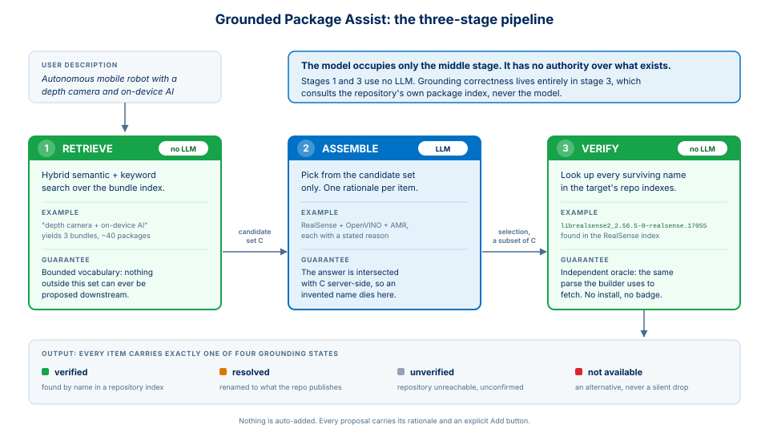
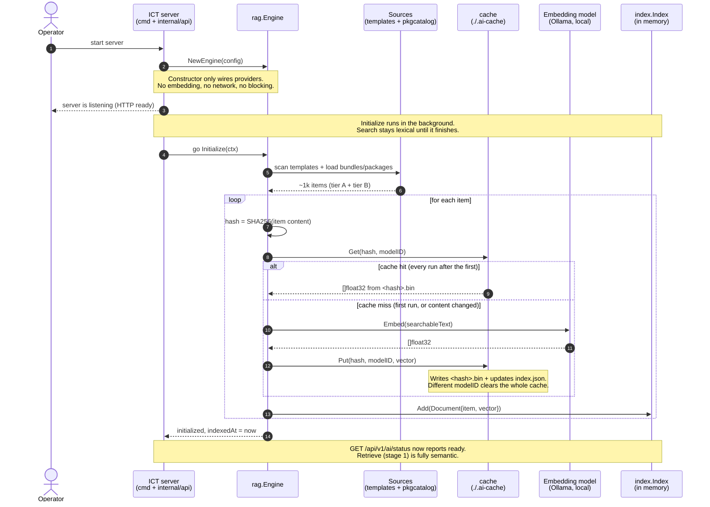

<!--
SPDX-FileCopyrightText: (C) 2026 Intel Corporation
SPDX-License-Identifier: Apache-2.0
-->

# ADR: Natural-Language Package Selection (Grounded Package Assist)

**Status**: Proposed
**Date**: 2026-08-04
**Authors**: ICT Team
**Technical Area**: AI/ML, Web UI, Package Management
**Depends on**: [adr-template-enriched-rag.md](adr-template-enriched-rag.md), [adr-web-ui-tech-stack.md](adr-web-ui-tech-stack.md)
**Related**: [adr-dep-analyzer.md](adr-dep-analyzer.md)

---

## Summary

The Advanced mode Packages step asks the user to pick packages by name from
tens of thousands of candidates spread across every enabled repository. That
only works for people who already know Linux package naming. This ADR proposes a **grounded** natural-language
front end to that step: the user describes the image in plain English, and the
system proposes bundles and packages that are **each confirmed to exist in the
real package metadata** of the target's repositories.

The core claim of this design is one sentence:

> **The LLM may only choose from packages that were retrieved from our index, and
> every choice it makes is then independently verified against real repository
> metadata before the user ever sees it.**

The model never invents a package name, because the only names it can emit are
names we handed it, and any name that fails verification is shown as a failure
with an alternative. It is never silently dropped, never quietly presented as fine.

---

## Context

### Problem statement

Advanced mode exists so a platform engineer can compose a bespoke image rather
than pick a pre-authored template. The Packages step is where that promise
either lands or fails:

| Reality today | Consequence |
|---|---|
| Any single base distribution publishes tens of thousands of packages, and every enabled add-on repository stacks on top | Search only helps if you already know the name |
| Real names are non-obvious: `librealsense2_2.56.5-0~realsense.17055`, `ros-jazzy-collab-slam-lze`, `intel-level-zero-npu` | Users cannot guess them |
| A capability spans repos: a depth camera needs a DKMS module (RealSense repo) + SDK (RealSense) + ROS bridge (ROS repo) + kernel headers (Ubuntu) | Users don't know a set is incomplete until the build fails |
| A wrong package name fails **at build time**, minutes in, inside a chroot | Slowest possible feedback loop |

The user knows *what the machine must do* ("autonomous mobile robot with a depth
camera and on-device inference"). They do not know *what it must contain*. That
gap is the product problem.

### Why not "just add a chatbot"

An ungrounded LLM answering "what packages do I need for a depth camera?" will
confidently produce plausible, wrong names: `librealsense2-dev` (not published
in that repo), `ros-humble-realsense2-camera` (wrong ROS distro), `cuda-toolkit`
(wrong silicon vendor). Each one is a build failure discovered minutes later,
and worse, it teaches users the feature cannot be trusted. Feature adoption dies
on the first hallucinated name.

So the design constraint is not "add AI to the Packages step". It is: **make the
suggestion mechanically incapable of naming a package that does not exist.**

---

## Decision

Implement a **three-stage pipeline** (Retrieve, Assemble, Verify) in which the LLM
occupies only the middle stage and has no authority over what exists.



*Green stages use no LLM. Each stage states the guarantee it contributes: stage 1
bounds the vocabulary, stage 2 cannot escape it, stage 3 confirms it against the
repository. The four output states are the same four the UI shows.*

Two properties follow structurally, not by prompt discipline:

1. **Bounded vocabulary.** The assemble prompt contains the candidate list. The
   response is filtered against that same list server-side; anything outside it
   is dropped before verification. A hallucinated name cannot survive the filter.
2. **Independent oracle.** Verification does not consult the model, the index, or
   the prompt. It consults the repository's own package index, the same parse
   that the builder itself uses to fetch packages. If the builder can install it,
   we say verified; if not, we don't.

### The two stages that need no LLM at all

Worth stating plainly, because it shapes cost and latency: **a plain search box
needs stage 1 only**, and **grounding correctness lives entirely in stage 3**.
The LLM contributes selection and explanation, which is genuinely useful but not
load-bearing for truth. If Ollama is down, search still works and the step
degrades to today's manual behaviour rather than breaking.

---

## Stage 1: Retrieve

### Corpus tiering (the key scaling decision)

We do **not** embed the long tail of every enabled repository. Embedding cost,
index size, and cache churn would all be dominated by packages nobody composing
an edge image will ever ask for (`texlive-lang-mongolian`), while the useful
signal lives in a small set. The corpus we do embed is bounded by design, not
by how many repositories a customer happens to enable.

| Tier | Contents | Size | Retrieval method |
|---|---|---|---|
| **A · Bundles** | Curated cross-repo capability sets (RealSense camera, OpenVINO inference, AMR robotics, NPU, ROS 2 desktop, Gazebo) | ~10s of vectors | **Embedded.** Highest signal per vector: a bundle *is* a use case. |
| **B · Curated + mined packages** | Hand-curated packages, plus every package appearing in the shipped templates | ~100s–1k of vectors | **Embedded.** Co-occurrence in a working template is real semantic context: `librealsense2-dkms` sitting beside `linux-headers-generic` teaches the relationship for free. |
| **C · Long tail** | Everything else in every enabled repo | Grows with repos; typically tens of thousands per distro | **Lexical only** (BM25-style over name + `Description`). Optionally lazy-embed a package the first time it is actually retrieved. |

Tier A carries the most weight deliberately: matching "autonomous mobile robot"
to a curated *bundle* gives a complete, tested, cross-repo package set, which
is exactly the thing users cannot assemble themselves.

### Reuse, not reinvention

Everything needed for tiers A and B already exists and ships today:

| Existing component | Reused as-is |
|---|---|
| `provider.EmbeddingProvider` | Ollama `nomic-embed-text` default; OpenAI optional. Zero-config, offline-capable. |
| `internal/ai/cache` | Content-hash embedding cache, model-ID-keyed, binary float32 vectors. Second startup is a cache read. |
| `index.Index` hybrid search | Semantic + keyword + package-overlap blend, MinScore floor, negation penalty. |
| `debutils` / `rpmutils` `ParseRepositoryMetadata` | Already returns `Description` per package, so tier C's text source and stage 3's verification oracle are **the same call**. No new metadata parsing anywhere in this design. |

Negation handling matters more here than for templates. "ROS 2 **without**
simulation" must actively penalise `gz-harmonic`; the existing
`calculateNegationPenalty` does this, which is a strong argument for reusing the
index rather than writing a second, simpler scorer.

### The one real refactor: generalise `index.Document`

`index.Document` is typed to `*template.TemplateInfo`, and the three scoring
functions reach into template-specific fields (`FileName`, `Distribution`,
`ImageType`, `Architecture`). To index bundles and packages we introduce a small
interface and make scoring depend on behaviour rather than a concrete struct:

```go
// Item is anything the index can rank: a template, a bundle, or a package.
type Item interface {
    ID() string             // stable identity (filename, bundle id, package name)
    Keywords() []string     // keyword-overlap scoring input
    PackageNames() []string // package-overlap + negation scoring input
    SearchableText() string // text that was embedded
}
```

`template.TemplateInfo` gains four thin methods (its data already supports all
four). `Document.TemplateInfo` becomes `Document.Item`. This is a mechanical
change across ~11 construction sites, and it is the difference between one
maintained scorer and two that drift apart.

> Alternative considered: **a parallel package index** with its own simpler
> scorer. Rejected: it duplicates negation handling and hybrid weighting, and
> the two copies will diverge on the first tuning change.

### Catalog data location

Bundles and curated packages live in `internal/ai/pkgcatalog/data/*.yaml`,
embedded with `go:embed`, with an `ai.catalog_dir` override for editing without
a rebuild, the same pattern as `internal/api/service/data/manifest.yaml`. The
prototype's `BUNDLE_DB` / `PACKAGE_DB` are the seed content.

### Where the vectors live, and who populates them

There is **no external vector database**. This matters for the zero-config
requirement: adding Postgres/pgvector, Qdrant or Chroma would mean a service to
run, a schema to migrate and a connection to configure, none of which a
single-user CLI tool that must work air-gapped can assume.

Instead we reuse the two-part store that ships today:

| Layer | What it is | Lifetime |
|---|---|---|
| **Vector store** | `index.Index`: a slice of `Document` with `[]float32` embeddings, brute-force cosine similarity under an `RWMutex` ([internal/ai/index/index.go](../../internal/ai/index/index.go)) | In-process, rebuilt on start |
| **Embedding cache** | `internal/ai/cache`: one `<content-hash>.bin` per vector (little-endian float32) plus an `index.json` manifest keyed by embedding model ID ([internal/ai/cache/cache.go](../../internal/ai/cache/cache.go)) | On disk, survives restarts |

Bundles and packages **share one cache and one in-memory index**, not separate
stores. `./.ai-cache/embeddings/vectors/<hash>.bin` holds one vector per file
regardless of whether it represents a bundle, a curated package, or a
template; `index.json` is the single manifest. What differs between them is
the *text* that gets embedded (so the hashes differ, and the cache never
collides) and the *retrieval-time grouping* in the response (bundles are
all-or-none and enable their repos; loose packages are not).

Brute-force cosine over the corpus we are proposing is the right call, not a
compromise. Tiers A and B are **~1k vectors at 768 dimensions**: a single scan is
roughly 3 MB of sequential float math, sub-millisecond, and it needs no ANN
index, no recall tuning and no rebuild step. An approximate index earns its
complexity somewhere north of 100k vectors, which is exactly the scale tier C's
lexical-only decision keeps us away from.

**Population is `Engine.Initialize` extended, not new machinery.** The existing
loop already does content-hash lookup, embed-on-miss, cache-write and index-add
for 61 templates; bundles and packages become two more sources feeding the same
loop:

| Tier | Source | Embedded text | Hash input (the cache key) |
|---|---|---|---|
| **A · Bundles** | `pkgcatalog` YAML | Bundle name, description, use-case keywords, member package names | The bundle's YAML block |
| **B · Curated + mined** | `pkgcatalog` YAML, plus package names harvested from the 61 templates' `systemConfig.packages` | Package name, its repo `Description`, and the names it co-occurs with in templates | Package name + description + the sorted co-occurrence set |
| **C · Long tail** | `ParseRepositoryMetadata` per enabled repo | Not embedded | Not applicable: lexical only |

### Startup: how embeddings actually get built

The flow in order. The important thing to notice is the branch at step 6: the
embedding model is called **only on a cache miss**, which is why a cold first run
costs minutes and every run after it costs milliseconds.



Read out loud, it is four sentences:

1. **The server starts and serves immediately.** Building the index is a
   background job, not a startup gate, so a missing or slow Ollama can never stop
   ICT from booting.
2. **Every item is hashed, and the hash is the cache key.** Not the filename, so
   renaming a template costs nothing and editing one costs exactly one vector.
3. **The model is called only on a miss.** Cold run: ~1k calls, a minute or two on
   laptop CPU. Warm run: ~1k file reads, tens of milliseconds, no network at all.
4. **Vectors land in an in-process index.** When the loop finishes, stage 1 goes
   from lexical to fully semantic, and `/api/v1/ai/status` flips to ready.

Because the cache key is a content hash and not a filename, the invalidation
story needs no new logic. Edit a bundle's description and only that vector is
recomputed. Add a template and only the packages whose co-occurrence set changed
are recomputed. Switch embedding model and `Cache.Put` already detects the
model-ID change and clears the whole cache, which is the correct behaviour
because vectors from different models are not comparable.

Costs, stated concretely so the review can push back on them:

- **First run, cold cache:** ~1k embed calls against local Ollama
  `nomic-embed-text`. Order of a minute or two on a laptop CPU, and it is
  why [readiness](#readiness) is asynchronous rather than blocking server start.
- **Every later run:** ~1k cache reads, no model calls, no network. Tens of
  milliseconds.
- **Disk:** ~1k x 768 x 4 bytes, roughly **3 MB**.
- **Tier C:** zero embedding cost by construction, which is the whole point of
  the tiering.

Two things this design deliberately does not do. It does not embed on the
request path, because a user waiting on the assist should never be waiting on
corpus construction. And it does not persist `index.Index` itself: rebuilding
from the cache is fast enough that a serialized index would be a second
consistency problem for no measurable gain.

> **One gap to close in implementation, not design.** `cache.CacheEntry` has a
> `Template string` field, which is metadata only (`Get` keys on the content
> hash) but will read as a lie once bundles and packages share the cache. Rename
> it to something source-neutral such as `Source`, with a `Kind` discriminator
> for debuggability. It is a JSON field in a regenerable cache, so the migration
> is to let the old cache miss once.

Note that the RAG engine is currently reachable only from the
[`ai` CLI command](../../cmd/image-composer-tool/ai_cmd.go) and is not yet
constructed by the API server. Standing up a server-lifetime engine, with the
background initialization described under [readiness](#readiness), is part of
this work rather than something to inherit.

---

## Stage 2: Assemble (the only LLM step)

Input: the user's description + the retrieved candidate set, each candidate
carrying its name, description, and source repository.

Output: a selection **plus a one-line rationale per item**. The rationale is a
first-class deliverable, not decoration: it is what lets a reviewer judge the
suggestion instead of trusting it. "Intel RealSense depth camera: kernel driver,
SDK, and ROS 2 bridge" tells the user why four packages arrived together.

Enforcement, in order:

1. The prompt states that only listed candidates may be selected.
2. The response is intersected with the candidate set server-side. **This is the
   actual guarantee**; step 1 is merely cooperative.
3. Anything outside the candidate set is discarded and counted in a metric. A
   rising counter here is a retrieval-quality signal worth alerting on.

If the chat provider is unavailable, the endpoint returns retrieval results with
no rationales rather than failing. Degradation is graceful by construction.

---

## Stage 3: Verify (no LLM, and the reason this is trustworthy)

Every selected name is looked up in the parsed package metadata of the target's
configured repositories, behind one interface with per-distro adapters:

```go
// Package pkgquery answers "does this package exist, and what is it called?"
// against real repository metadata.
type Querier interface {
    Lookup(ctx context.Context, names []string) ([]Result, error)
    Search(ctx context.Context, terms string, limit int) ([]Result, error)
}
```

| Distro family | Adapter | Backing metadata |
|---|---|---|
| eLxr, Ubuntu, Debian | `debutils` | `Packages` / `Packages.gz` (APT) |
| Azure Linux | `rpmutils` | `repodata` primary.xml (DNF/TDNF) |

Transitive dependency resolution is explicitly **out of scope** here; it is
[adr-dep-analyzer.md](adr-dep-analyzer.md)'s concern and happens at build time.
This stage answers only existence and naming.

### Four outcomes, and why there are four rather than two

A naive design has two states (found / not found) and is wrong the moment a
mirror is unreachable, because "I couldn't reach the repo" gets reported as
"the package doesn't exist", a false negative that makes the tool look broken,
or, worse, as "verified", which is a false promise.

| State | Meaning | UI treatment | User's next move |
|---|---|---|---|
| **verified** | Found by name in a repository's package index | Green, `✓ verified`, add button | Add it |
| **resolved** | User's words mapped to the name actually published (`"depth camera driver"` → `librealsense2-dkms` + pinned SDK build) | Amber, `name resolved`, shows the mapping | Confirm the mapping |
| **unverified** | Repository unreachable, so existence is genuinely unknown | Grey, `unverified`, plus a named "N repositories unreachable" banner | Retry, or add at own risk |
| **not available** | Repos reachable, package absent | Red, `not found`, **and an alternative** | Take the offered alternative |

Two rules make this honest rather than merely colourful:

- **The headline count only counts `verified`.** "8 verified packages" never
  includes an unverified or missing one. Enforced by test.
- **A miss must carry an alternative, never a silent drop.** Ask for NVIDIA CUDA
  on an Intel platform and you are told plainly that no configured repository
  publishes it, *and* offered the OpenVINO bundle as the grounded equivalent.
  Silently omitting the request is the failure mode that destroys trust: the user
  believes their requirement was met.

### Partial bundles

A bundle whose members don't all verify reports **per-member outcomes**, never a
bare count: `verified[]`, `unverified[]`, `unavailable[]`. Adding it adds only
the members that could actually be found; unavailable names are struck through
and never enter the selection, and the bundle is not marked "applied" because it
isn't. The alternative designs (drop the whole bundle, or add all of it) are
respectively over-cautious and dishonest.

---

## API surface

Both endpoints are added to `api/v1/openapi-template-builder.yaml` first; the Go
interface is generated (`go generate ./internal/api/http`). No hand-registered
JSON routes; CI regenerates and diffs.

### `GET /api/v1/packages/search` (no LLM)

Semantic (tiers A+B) + lexical (tier C) search. This is the endpoint that also
backs the existing manual search box, which means the search box gets better as a
side effect of this work.

### `POST /api/v1/ai/select-packages` (SSE)

Streams the pipeline as it runs, reusing the existing `sendEvent` helper from
`internal/api/sse.go`:

| Event | Payload | Why stream it |
|---|---|---|
| `retrieve` | candidate counts | First feedback within ~100ms |
| `assemble` | selection in progress | The slow step (LLM); silence here reads as "hung" |
| `verify` | repos checked, reachability | Shows grounding *happening*, which is the trust moment |
| `result` | full response | Terminal |

Following the established precedent, this operation is added to
`exclude-operation-ids` in `internal/api/http/cfg.yaml` and hand-written
alongside the generated mux, the same treatment as `streamBuildLogs`.

Response shape (already implemented by the prototype's renderers, verbatim):

```jsonc
{
  "bundles":  [{ "id": "...", "why": "...",
                 "verified": [], "unverified": [], "unavailable": [] }],
  "packages": [{ "name": "...", "why": "...", "state": "verified", "repo": "..." }],
  "resolutions": [{ "asked": "...", "resolved": ["..."], "why": "..." }],
  "misses":   [{ "asked": "...", "why": "...", "suggestBundle": "..." }],
  "repoStatus": [{ "id": "...", "name": "...", "reachable": true }],
  "llmUsed": true
}
```

### Readiness

First-run embedding must not block server start. Index population runs in the
background; `GET /api/v1/ai/status` reports readiness, and search stays lexical
until the vector index is warm. Second and later starts are cache reads.

---

## UI design

The full interaction is implemented and clickable in
[web/prototype/template-builder.html](../../web/prototype/template-builder.html)
(Advanced → Packages). It is a functioning prototype with a simulated backend,
not a static mockup.

### Layout

**The prototype is the layout reference.** Open
[web/prototype/template-builder.html](../../web/prototype/template-builder.html)
and go to Advanced, then Repositories & Packages. Everything described below is
live there.

The structure, in words:

| Region | Contents |
|---|---|
| **Assist card** (top of the step) | Description textarea, three example chips, **Suggest packages** button |
| **Grounding trace** (inside the card, while running) | Three ticking stages: retrieve, assemble, verify. The verify line names how many repository indexes are being searched |
| **Degraded banner** (only when a repository is unreachable) | Amber, names the repository, and states that its packages are shown unverified because we could not confirm them |
| **Results** (inside the card) | Headline count of verified packages, an **Add all verified** button, the four-state legend, then one row per proposed bundle and loose package, each with its rationale, its per-state badges, its member package names, and an **Add** button |
| **Resolutions** (inside the card, when a term was renamed) | What the user asked for, in quotes, above the real package names it resolved to |
| **Manual controls** (below the card, unchanged) | Search Packages, Use-Case Bundles, Browse Repositories |
| **Selected rail** (right column, unchanged) | Running package count, per-package remove, count of enabled repositories |

The assist sits **above** the existing manual controls, all of which remain
untouched and fully usable. The step gains a faster path; it does not lose the
old one. Both paths write to the same selection state, so the right-hand rail
cannot tell an assisted package from a hand-picked one.

### Five UI decisions worth defending

1. **The grounding trace is visible.** The three stages stream with ticks. Users
   see *"verifying against 8 repository package indexes"* happen. This is the
   single most important pixel in the feature: it converts "the AI suggested
   this" into "this was checked".

2. **Proposals are proposals.** Nothing is auto-added. Every row has an explicit
   Add; there is an "Add all verified" for speed. The user remains the author of
   the image, which is also what keeps this reviewable in a regulated context.

3. **Suggested and hand-picked are indistinguishable once added.** The assist
   writes to the *same* selection state as the manual controls, so an assisted
   package appears in the same rail and is removed the same way. No parallel
   "AI packages" concept to reason about, no second removal path.

4. **Failure is shown, with a route forward.** Unreachable repos get a named
   banner. Missing packages get an alternative button. The feature is
   most credible in exactly the moments it cannot deliver.

5. **Rationales, not just names.** Each row says why. A user who disagrees can
   act on the disagreement.

---

## Consequences

### Positive

- A user who knows their workload but not Linux packaging can complete the
  Packages step. That is Advanced mode's addressable audience, widened.
- Wrong-package build failures shift from minutes-in-a-chroot to before the build.
- The manual search box improves for free (shared retrieval).
- No new infrastructure: no vector DB, no external service, no API key. Ollama
  local by default; offline-capable.
- Verification reuses the builder's own metadata path, so "verified" means
  *the builder can install this*, not *a model thinks so*.

### Negative / accepted costs

- **First-run embedding cost.** Mitigated: small corpus, background population,
  persistent cache, lexical search available immediately.
- **`index.Document` refactor touches existing code and tests.** Accepted as the
  price of one scorer instead of two.
- **LLM latency** (~1–3s local) is the dominant cost of the assemble step.
  Mitigated by SSE: the user sees progress from ~100ms.
- **Curated corpus needs maintenance.** Mitigated by mining templates
  automatically, so the corpus grows as templates are added.

### Risks and mitigations

| Risk | Mitigation |
|---|---|
| Hallucinated package name reaches the user | Structurally impossible: candidate-set intersection **and** independent metadata verification |
| Model picks a plausible-but-wrong candidate | Verification catches non-existence; per-item rationale exposes bad reasoning to the reviewer |
| Repository unreachable | `unverified` state + named banner; never reported as verified or as absent |
| Retrieval misses a valid capability | Empty-state guides toward capability wording; manual controls remain fully available; out-of-candidate-set counter monitors retrieval quality |
| `debutils` package-level mutable globals (`RepoCfg`, `RepoCfgs`, `UserRepoCfgs`, `GzHref`, …) race under a long-lived server with concurrent requests | **Must be addressed before this ships.** Either serialise queries behind a mutex in `pkgquery` (simple, adequate for a single-user tool) or thread an explicit config value through the adapter (correct, larger). Recommend the mutex first, with the refactor tracked separately. This is a pre-existing hazard that concurrency in this feature would expose. |

---

## Alternatives considered

| Alternative | Why rejected |
|---|---|
| **Ungrounded LLM suggestions** | Hallucinated names → build failures → the feature is distrusted after one bad answer. |
| **Embed every package in every enabled repo** | Cost and index size dominated by irrelevant packages; tiered retrieval gets the same recall for the queries users actually make, and stays bounded as customers enable more repos. |
| **Keyword search only, no LLM** | Cannot bridge "autonomous mobile robot" → `ros-jazzy-collab-slam-lze`. That bridge is the entire value. |
| **Verify at build time only** | Feedback arrives minutes later inside a chroot, which is the problem we are solving. |
| **External vector DB** | New dependency and deployment surface for a corpus of ~1k items an in-memory index handles. |
| **Parallel package index** | Duplicates negation + hybrid scoring; the copies will diverge. |
| **Two states (found / not found)** | Misreports unreachable repos as absent packages, or worse as verified. |

---

## Open decisions for review

1. **Verification cache key.** Repository `Release` checksum (correct,
   invalidates when the mirror moves) vs. a time-boxed TTL (simpler). Recommend
   the checksum, matching `ParseRepositoryMetadata`'s existing cache discipline.
2. **`debutils` global state.** Mutex in `pkgquery` now, explicit-config refactor
   tracked separately, or block on the refactor. Recommend the former.
3. **Lazy-embedding tier C.** Ship lexical-only first, add lazy embedding if
   retrieval-quality metrics show it is needed.
