# ADR: Integrate OEP Installer Profiles Through a Solution-Owned DEB Dependency Interface

- **Status:** Accepted
- **Date:** 2026-09-11
- **Decision owners:** OEP Installer and Image Composition Tool (ICT) teams

## Context

ICT composes ready-to-use operating-system images. Solutions selected through
the WebUI are represented by OEP Installer profiles, which may require Debian
packages in addition to software installed and configured by `oep-installer`.

An OEP profile may introduce several kinds of software:

- Debian packages installed through the native package manager
- Python distributions installed into one or more Python environments
- Container images pulled directly or referenced through Compose
- Other artifacts such as models, archives, source repositories, configuration,
  and generated files

The required Debian packages must be present in the image before first boot.
ICT already owns native package installation during composition and performs
full dependency resolution. Installing those packages through ICT also ensures
that an `apt install` of the same dependencies by `oep-installer` is a no-op
when it runs against an ICT-generated image.

The integration does not make ICT responsible for installing or inventorying
all software associated with an OEP profile. `oep-installer` continues to run
on first boot for solution content such as `~/oep-apps`, containers, models,
Python environments, and other non-DEB artifacts. It runs as the user created
from the image template and requires network connectivity at first boot.

The SBOM boundary follows the composition boundary. ICT generates SBOM entries
only for Debian packages that it installs and embeds in the image, including
the dependency closure resolved during composition. Software installed later
by `oep-installer` is not included in the ICT-generated SBOM. Extending
inventory or SBOM coverage to those artifacts would require a separate
interface from `oep-installer` and is outside this decision.

Two integration approaches were considered:

1. ICT owns a mapping from WebUI solution and SKU selections to curated ICT
   templates and their required Debian packages.
2. The solution owns a minimal interface that returns the Debian package
   requirements for a selected OEP Installer profile, and ICT consumes that
   list through its standard composition flow.

## Decision

Adopt **Option 2: a solution-owned dependency interface**.

The solution shall expose a minimal, machine-readable command or API that
returns the Debian packages required by a selected `oep-installer` profile.
The dependency query must use the same profile definitions and package
selection logic as installation so that it remains the source of truth for the
profile's requirements.

ICT shall consume the returned package list and add it to the standard image
composition flow. ICT remains responsible for repository configuration,
package installation, full transitive dependency resolution, and recording the
Debian packages actually embedded in the image in its SPDX SBOM.

After the composed image boots, `oep-installer` shall run for the selected
profile under the user defined by the image template. It may retain its
existing Debian package installation logic; packages already installed by ICT
will be satisfied and require no further installation. The installer remains
responsible for the rest of the solution software and requires network access
at first boot.

The initial interface is intentionally limited to Debian package requirements.
It is not a general installation-intent manifest and does not describe Python
packages, container images, models, source repositories, or other first-boot
artifacts.

## Integration Flow

```mermaid
flowchart LR
    Selection["WebUI solution / SKU selection"]
    Profile["Selected OEP Installer profile"]
    Query["Query solution-owned DEB dependency interface"]
    Compose["ICT standard composition flow"]
    Resolve["Resolve and install complete DEB dependency set"]
    SBOM["Generate SBOM for DEBs embedded by ICT"]
    Boot["Boot composed image"]
    Install["Run oep-installer profile as template-defined user"]
    Content["Install remaining solution content over network"]

    Selection --> Profile --> Query --> Compose --> Resolve --> SBOM --> Boot
    Boot --> Install --> Content
    Profile --> Install
```

## Roles and Responsibilities

### Solution and OEP Installer

The solution team is responsible for:

- Owning the Debian package requirements for each profile
- Exposing those requirements through a stable, machine-readable command or
  API
- Deriving the dependency response from the same source used by installation
- Returning deterministic results for the same profile and solution version
- Maintaining the first-boot behavior for non-DEB solution software
- Running `oep-installer` under the template-defined user after first boot

The solution interface declares direct Debian package requirements. It is not
responsible for resolving the complete transitive Debian dependency graph or
generating the image SBOM.

### Image Composition Tool

ICT is responsible for:

- Passing the selected profile to the solution-owned dependency interface
- Validating and consuming the returned Debian package list
- Adding the requested packages to the standard composition flow
- Resolving and installing the complete Debian dependency set
- Failing composition clearly when requirements cannot be queried, resolved,
  or installed
- Generating the SPDX SBOM for Debian packages installed and embedded during
  composition
- Configuring the selected profile to run through `oep-installer` at first boot
  under the template-defined user

ICT does not maintain solution-specific dependency mappings and does not own
the installation, inspection, or SBOM generation for software added by
`oep-installer` after first boot.

## Interface Requirements

The dependency interface shall:

- Accept an unambiguous profile identifier
- Return only direct Debian package requirements; ICT resolves transitive
  dependencies
- Use a stable, machine-readable representation
- Be versioned so incompatible changes can be detected
- Produce deterministic output without installing packages or changing the
  host
- Distinguish a valid profile with no Debian requirements from an unknown or
  invalid profile
- Return actionable errors for unsupported profiles or failed resolution

The exact command, transport, and response schema shall be defined in a
separate interface specification. A simple CLI that emits versioned JSON is
sufficient for the initial implementation.

## Options Considered

### Option 1: ICT-owned mapping

ICT would map each WebUI solution and SKU selection to a curated template and
an ICT-maintained Debian package manifest. The solution team could continue to
provide its existing `oep-installer` profiles without adding a dependency-query
interface.

This option is easier for the solution team in the short term, but it makes ICT
partly responsible for every solution's packaging definition. Every profile or
dependency change would require coordinated updates to ICT mappings or
templates. The duplicated package definition could drift from the installer
profile, and implementation and debugging costs would grow with every solution,
vBU, SKU, and profile combination.

### Option 2: Solution-owned dependency interface

The solution exposes a small command or API that returns the Debian package
requirements for a selected profile. ICT consumes that list generically and
installs the packages through its existing composition flow.

This option requires a small implementation commitment from the solution team,
but preserves a clear ownership boundary: the solution owns its requirements,
while ICT owns image composition and Debian package resolution. It avoids
duplicated package definitions, lowers the risk of drift, supports standard
platform templates, and scales without adding solution-specific mappings to
ICT.

### Comparison

| Vector | Option 1: ICT-owned mapping | Option 2: solution-owned dependency interface |
| --- | --- | --- |
| Flow | WebUI selection -> ICT maps solution/SKU to a curated template -> first boot runs `oep-installer <profile>` | WebUI selection -> ICT queries the selected solution/profile for required DEBs -> ICT adds them to the standard composition flow -> first boot runs `oep-installer <profile>` |
| ICT implementation effort | Higher. ICT creates and maintains mappings and templates for every solution/SKU. | Lower. ICT implements one generic mechanism to consume a DEB dependency list. |
| Coupling | Tight. ICT must know each solution's package requirements. | Loose. The solution owns and exposes its requirements. |
| Change management | Poorer. DEB dependency changes require coordinated ICT updates. | Better. Dependency changes are reflected through the solution-provided interface. |
| Risk of drift | Higher. The ICT mapping and `oep-installer` profile can get out of sync. | Lower. Dependency information comes from the solution/profile definition. |
| Standard platform templates | Harder. The model tends toward solution-specific ICT templates. | Cleaner. A standard platform template is augmented with dynamically queried packages. |
| DEB installation | ICT installs packages during composition from its maintained manifest. | ICT installs packages during composition from the solution-returned dependency list. |
| DEB SBOM coverage | Yes, for DEBs actually installed and embedded by ICT. | Yes, for DEBs actually installed and embedded by ICT. |
| Non-DEB SBOM coverage | No. Content installed later by `oep-installer` is outside the ICT SBOM. | No. The same limitation applies unless `oep-installer` later provides separate inventory or SBOM metadata. |
| First-boot dependency | `oep-installer` still runs for `~/oep-apps`, containers, models, and other solution content. | Same. |
| Network required at first boot | Yes. | Yes. |
| Ownership boundary | Blurred. ICT effectively owns part of each solution's packaging definition. | Clear. The solution owns requirements; ICT owns composition. |
| Scalability across vBUs/SKUs | Poorer. Maintenance grows with every profile/SKU combination. | Better. The generic interface scales across profiles. |
| Failure and debugging model | More complex. Teams must determine whether the ICT mapping or installer profile is wrong. | Cleaner. The dependency query and installer profile remain solution-owned. |
| Near-term team effort | Little or no new solution-team work, but recurring work moves to ICT. | A small solution-team CLI/API addition reduces long-term work and coordination. |

## Rationale for Rejecting Option 1

Option 1 is rejected because its short-term convenience does not justify the
long-term ownership and maintenance costs. In particular, it would:

- Couple ICT to the package details of each solution and SKU
- Duplicate dependency definitions across ICT and `oep-installer`
- Require coordinated ICT changes whenever a solution changes its DEBs
- Create a persistent risk that ICT mappings drift from installer profiles
- Encourage solution-specific templates instead of reusable platform templates
- Scale implementation, maintenance, and debugging effort with every new
  profile combination

These are structural costs rather than temporary implementation costs. Option
2 places the dependency definition with the team that can keep it correct while
allowing ICT to remain a generic image composer.

## SBOM Scope

The ICT-generated SPDX SBOM covers the set of Debian packages that ICT actually
composes into the image. This includes packages directly returned by the
solution interface and any transitive Debian dependencies installed by ICT.

The SBOM does not claim coverage for software installed by `oep-installer` at
first boot, including Python distributions, containers, models, cloned source,
archives, generated content, or other non-DEB artifacts. It also does not infer
such content from the selected profile. Consumers must not interpret the ICT
SBOM as a complete inventory of the system after first-boot installation.

## Consequences

### Benefits

- The solution remains the source of truth for profile-specific dependencies.
- ICT gains a generic integration that does not encode solution/SKU knowledge.
- Debian packages and their dependency closure are installed before first boot.
- Existing package installation in `oep-installer` remains compatible and
  becomes a no-op for packages already present.
- The SBOM has a precise, observable boundary based on what ICT composes.
- Standard platform templates remain reusable across solutions.
- Package requirement changes do not require synchronized ICT template edits.

### Costs and risks

- The solution team must implement and maintain the dependency command or API.
- ICT composition depends on the interface being available and compatible.
- The query and installation paths could still drift if the solution does not
  derive both from the same definitions and test them together.
- The ICT-generated SBOM is intentionally incomplete for the post-first-boot
  system because it excludes software installed later by `oep-installer`.
- First-boot installation still depends on network availability and executes
  with the permissions of the template-defined user.

## Alternatives Considered

### Parse installer implementation or dry-run output

Rejected. Shell implementation details and human-readable output are not a
stable dependency contract. Computed values, conditional branches, and output
format changes make this approach unreliable.

### Have ICT infer first-boot artifacts

Rejected. ICT does not install or observe the final state of first-boot
solution content during composition. Inferring Python packages, containers,
models, or other artifacts from a profile would broaden ICT ownership and still
would not produce an authoritative post-installation inventory.

### Require a complete installation-intent manifest

Rejected for this integration. A manifest covering every artifact class would
substantially enlarge the interface and ICT's inspection responsibilities. The
current requirement is satisfied by exposing only the Debian packages needed
during composition. Broader inventory or SBOM coverage can be considered in a
separate decision.

## Adoption

1. Define the versioned command or API and its machine-readable response.
2. Implement the solution-side dependency query from the same profile data used
   by `oep-installer`.
3. Add an ICT integration that validates the response and supplies the returned
   packages to the standard composition flow.
4. Test a representative profile end to end, including transitive dependency
   resolution, SBOM inclusion, and first-boot execution.
5. Verify that repeated package installation by `oep-installer` is a no-op on
   the composed image and that remaining first-boot content installs under the
  template-defined user with network connectivity.
