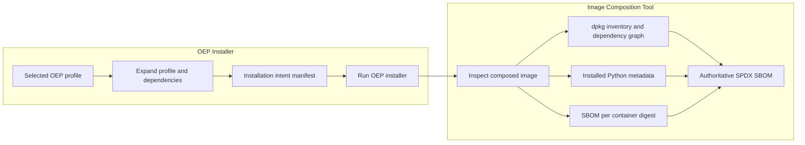

# ADR: Generate an OEP Installation Intent Manifest

- **Status:** Proposed
- **Date:** 2026-09-11
- **Decision owners:** OEP Installer and Image Composition Tool (ICT) teams

## Context

ICT composes ready-to-use operating-system images. It installs the packages that
form the base image and may invoke the OEP Installer to add software selected
through OEP profiles and components.

An OEP profile may introduce several kinds of software:

- Debian or RPM packages installed through the native package manager or from
  local package files
- Python distributions installed into one or more Python environments
- Container images pulled directly or referenced through Compose
- Other artifacts such as models, archives, source repositories, configuration,
  and generated files

ICT must generate an accurate SPDX Software Bill of Materials (SBOM) for the
completed image. Today, the OEP Installer does not expose a stable,
machine-readable description of the artifacts a selected profile intends to
install. Inferring that information from shell modules or human-readable
dry-run output is unreliable because artifact names and versions may be
computed dynamically, installation paths may contain conditional branches, and
some references may not exist until installation has begun.

The OEP Installer already owns profile expansion, component dependency
resolution, and the association between components and the top-level artifacts
they request. ICT owns the completed image, final-state inspection, and
generation of the authoritative SBOM.

An explicit contract is therefore required between the two systems.

## Decision

The OEP Installer shall expose a versioned, machine-readable **installation
intent manifest** describing:

- The profiles or components originally requested
- The complete set of components produced by profile and dependency expansion
- The top-level software artifacts requested by each component
- The target environment or containment scope for each artifact, where
  applicable
- Whether the manifest is complete and any known reasons for incomplete
  metadata

The manifest describes **installation intent**, not the final installed state,
and is not itself an SPDX SBOM.

ICT shall consume this manifest, execute or coordinate installation, inspect the
resulting system and contained artifacts, and generate the authoritative SPDX
SBOM from the observed state. This includes resolving installed versions,
transitive dependencies, immutable container identities, and containment
relationships.

JSON shall be the canonical interchange format. The contract shall use a
versioned schema so the OEP Installer and ICT can evolve independently. A
human-readable rendering may be provided, but automated consumers shall rely on
the JSON contract.

## Roles and Responsibilities



The diagram shows the principal ownership boundary. ICT may invoke external
package resolvers and scanners, but it remains responsible for the final result
and its provenance.

### OEP Installer

The OEP Installer is responsible for:

- Expanding requested profiles and component dependencies using the same
  semantics as installation
- Declaring the top-level artifacts requested by each resolved component
- Preserving attribution from requested profile to component to artifact
- Identifying relevant target environments, such as a native Python environment
  or container
- Reporting conditional, unresolved, or installation-time-only artifacts as
  incomplete metadata
- Producing deterministic output without installing, pulling, cloning, or
  downloading artifacts
- Excluding credentials, tokens, and other sensitive runtime configuration

The OEP Installer is not responsible for resolving the complete native-package
dependency graph, scanning container contents, inventorying the completed
filesystem, or constructing the final SPDX graph.

### Image Composition Tool

ICT is responsible for:

- Declaring or retaining attribution for software it installs independently of
  the OEP Installer
- Validating the installation intent manifest against a supported schema
  version
- Running the OEP Installer with the same resolved request represented by the
  manifest
- Inspecting the completed native filesystem and installed Python environments
- Determining installed package versions, architectures, and transitive
  dependencies
- Resolving container references to immutable digests and obtaining an SBOM for
  each unique image
- Preserving containment boundaries between the native system, Python
  environments, and individual containers
- Combining declared intent and observed state into the authoritative SPDX SBOM
- Recording the tools, versions, timestamps, and other provenance used to
  generate the SBOM

A before-and-after inventory may be used as supporting evidence, but it does not
replace explicit attribution of top-level requests to OEP components.

### Artifact ownership

| Artifact class | OEP Installer provides | ICT establishes for the final SBOM |
| --- | --- | --- |
| Native DEB/RPM | Directly requested package and component attribution | Installed version, architecture, dependency closure, and native-system scope |
| Native Python | Direct requirement, installer, environment, and component attribution | Resolved and installed distributions within the named environment |
| Container image | Image reference, origin, and component attribution | Immutable digest and container-specific SBOM |
| Other artifact | Identity or locator, type, checksum if known, and attribution | Observed identity, containment, and available producer or generated SBOM |

## Contract Requirements

The installation intent contract shall:

- Be versioned and machine-readable
- Represent requested targets, resolved components, artifacts, and component
  attribution
- Initially support native packages, Python requirements, and container images
- Represent environment or containment scope where the same package may exist
  in multiple locations
- Distinguish direct requests from resolved dependencies
- Indicate completeness and provide machine-readable warnings or reasons when
  metadata is incomplete
- Produce stable ordering and deterministic output for identical inputs
- Be generated without side effects or access to installation credentials
- Work for both the source-tree CLI and the rendered, self-contained CLI

The normative schema and detailed command-line interface shall be maintained as
a separate interface specification. Incompatible contract changes require a new
major schema version.

## Illustrative Manifest

The following example is non-normative and illustrates the minimum concepts
rather than prescribing the final schema:

```json
{
  "schemaVersion": "1.0.0",
  "kind": "oep-installation-intent",
  "complete": true,
  "request": {
    "targets": ["inferencing"]
  },
  "components": [
    { "name": "openvino" }
  ],
  "artifacts": [
    {
      "type": "debian-package",
      "name": "openvino-2026.3.0",
      "scope": "native",
      "requestedBy": "openvino"
    },
    {
      "type": "python-requirement",
      "requirement": "openvino-genai==2026.3.0",
      "environment": "openvino-genai",
      "requestedBy": "openvino"
    },
    {
      "type": "container-image",
      "reference": "registry.example/inference-service:1.4.0",
      "requestedBy": "openvino"
    }
  ],
  "warnings": []
}
```

The manifest records a container tag when that is all the installer knows. ICT
resolves the tag to an immutable digest and generates or consumes an SBOM for
that digest.

## SPDX Composition Principles

The final SBOM shall be based on the composed image and resolved artifacts, not
on declarations alone.

- Native packages are represented in the native-system scope.
- Packages within each container remain associated with that container image.
- Python distributions remain associated with their installation environment.
- Identical package names in different scopes are not flattened into a single
  ambiguous inventory.
- The image-level SPDX document may reference subordinate container SBOM
  documents instead of physically merging all components into one file,
  provided the relationships and immutable identities are preserved.

This structure allows a vulnerability or license finding to be traced to the
native image, a specific Python environment, or a specific container digest.

## Consequences

### Benefits

- ICT no longer parses installer implementation details or human-oriented
  output.
- Requested profiles, expanded components, and top-level artifacts remain
  attributable.
- The authoritative SBOM reflects resolved and observed software.
- Artifact and containment boundaries remain visible for vulnerability and
  license analysis.
- The versioned contract allows the OEP Installer and ICT to evolve
  independently.
- ICT remains an image composer and SBOM aggregator rather than taking ownership
  of every artifact installation mechanism.

### Costs and risks

- Existing OEP components require metadata and ongoing maintenance.
- Declared intent may drift from install behavior unless both paths share
  resolution logic and are tested together.
- Some artifacts are conditional or discoverable only during installation, so
  completeness must be represented honestly.
- ICT still requires ecosystem-specific inspection or scanning for native
  packages, Python environments, containers, and future artifact types.
- Consumers must handle supported schema versions and reject incompatible ones.

## Alternatives Considered

### Parse installer shell modules

Rejected. Computed values, conditional branches, helper functions, and shell
evaluation make static extraction unreliable and unsafe.

### Treat dry-run output as the contract

Rejected. Dry-run output is intended for people, does not provide stable
structured metadata, and may not execute the logic required to determine
artifact identities.

### Generate SPDX directly in the OEP Installer

Rejected. The installer knows requested artifacts but does not own the complete
filesystem, the final dependency graph, container contents, or composition
provenance. This would either produce an incomplete SBOM or duplicate ICT
responsibilities.

### Infer all OEP changes from system snapshots

Rejected as the sole mechanism. Snapshots provide useful evidence but lose the
relationship between profiles, components, and the top-level artifacts that
caused each change. They may also capture unrelated concurrent changes.

### Maintain static manifests per profile

Rejected. Static profile manifests duplicate dependency expansion and component
version-selection logic, creating a second source of truth.

## Implementation Guidance

The following guidance is intentionally non-normative:

- Reuse the installer's existing profile and component dependency resolution.
- Keep artifact metadata close to the component logic that selects versions.
- Centralize validation, stable ordering, deduplication, and JSON serialization.
- Generate metadata through side-effect-free providers; do not perform
  installation or network operations while producing the manifest.
- Compare installation intent with post-install inspection in representative
  integration tests.
- During migration, allow incomplete manifests with explicit warnings;
  introduce strict enforcement after coverage is complete.
- Keep the full JSON Schema, CLI options, provider API, resolver commands, test
  matrix, and migration mechanics in a separate interface and implementation
  design.

## Adoption

1. Approve this responsibility boundary and contract direction with the OEP
  Installer and ICT owners.
2. Define and review the normative JSON Schema and CLI contract in a separate
  interface specification.
3. Implement an initial vertical slice covering one native package, one Python
  environment, and one container image.
4. Validate ICT correlation, inspection, containment, and SPDX generation end
  to end.
5. Add metadata for remaining components while explicitly reporting incomplete
  coverage.
6. Require installation-intent metadata for new components and enable strict
  coverage checks when migration is complete.
