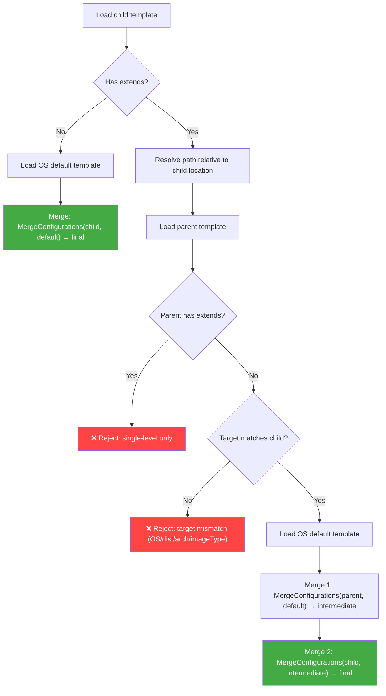

# ADR: Single-Level Template Extends

**Status**: Proposed  
**Date**: 2026-05-26  
**Authors**: ICT Team  
**Technical Area**: Template Configuration / Merge System

---

## Summary

Add an optional `extends` field to user templates, enabling single-level inheritance from a parent template. This allows users to maintain a minimal delta template that automatically inherits updates from the parent template.

---

## Context

### Problem Statement

Teams often publish reusable templates (e.g., `ubuntu24-x86_64-edge-raw.yml`) that define a baseline image configuration. Other users need to customize these for specific use cases, typically adding packages or changing the kernel. Today, they must copy the entire template and modify it. When the original template is updated (security patches, new default packages), every copy must be manually re-synchronized.

### Current System

ICT already implements a two-layer merge: OS-level default templates (`config/osv/`) are merged with the user template at build time, using well-defined per-attribute strategies (additive, override, replace, merge-by-key). This works well for OS-to-user inheritance but does not support template-to-template inheritance.

### Industry Precedent

Docker Compose, ESLint, and Spring Boot all use `extends` for single-level parent-child template inheritance with field-level overrides, the same semantics proposed here.

---

## Decision

Add an optional `extends` field to user templates, limited to a single level of inheritance.

### Template Example

**Parent template** (`ubuntu24-x86_64-edge-raw.yml`):
```yaml
image:
  name: ubuntu24-x86_64-edge
  version: "1.0.0"
target:
  os: ubuntu
  dist: ubuntu24
  arch: x86_64
  imageType: raw
systemConfig:
  packages:
    - docker-cli
    - containerd
    - openssh-server
  kernel:
    version: "6.8.0-49-generic"
```

**Child template** (`my-custom-edge.yml`):
```yaml
extends: "ubuntu24-x86_64-edge-raw.yml"

image:
  name: my-custom-edge

systemConfig:
  packages:
    - my-custom-app
    - monitoring-agent
  kernel:
    version: "6.8.0-50-generic"
```

**Resolved merge** (3 layers): OS defaults → ubuntu24-x86_64-edge-raw.yml → my-custom-edge.yml

### Merge Flow



The existing `MergeConfigurations()` is called twice. No changes to merge strategies are needed; they compose naturally for two invocations.

### Merge Strategies (unchanged)

| Section | Strategy | 3-layer behavior |
|---------|----------|-----------------|
| `packages` | Additive (deduplicated) | defaults ∪ parent ∪ child |
| `configurations` | Additive (append) | defaults, then parent, then child |
| `users` | Merge by `name` | Field-level override across all 3 layers |
| `disk` | Full replace | Last non-empty wins (child > parent > default) |
| `kernel` | Field-level override | Last non-empty field wins |
| `packageRepositories` | Merge by `codename` | Last codename match wins |

### Validation Rules

- **Single level only**: if the parent template contains `extends`, reject with a clear error
- **Circular reference**: child cannot extend itself
- **Target match**: child's `target` must match parent's `target` (prevents nonsensical cross-OS inheritance)
- **Path safety**: resolve paths with `filepath.Clean`, reject symlinks (existing `security.RejectSymlinks`), reject resolved paths that escape the child template's directory (i.e., disallow `../../../etc/` style traversal after cleaning)
- **Schema**: `extends` added as optional string to `UserTemplate` schema; stripped from merged result

### Changes Required

| Component | Change |
|-----------|--------|
| `ImageTemplate` struct | Add `Extends string` field |
| JSON schema | Add `extends` to `UserTemplate` definition |
| `LoadAndMergeTemplate()` | Extend to handle 3-layer merge when `extends` is present |
| `validate` command | Resolve `extends` chain during validation |
| `build` command | No changes needed (already calls `LoadAndMergeTemplate`) |
| CLI output | Log the resolved extends chain: `"Extending parent template: <path>"` |
| `resolve` subcommand (new) | Dump the fully-merged template to stdout for debugging/traceability |
| Tests | Basic extends, missing parent, chained rejection, target mismatch, circular ref, path traversal |
| Documentation | Template docs, CLI specification, examples |

### CLI/UX Changes

- **`build`**: When `extends` is used, log the parent template path at info level so users can see the inheritance chain in build output
- **`validate`**: Resolve the `extends` reference and validate the full merged result, not just the child template in isolation
- **`resolve` (new subcommand)**: Output the fully-merged template as YAML to stdout. Works for all templates, not just ones using `extends`. For a standard template it shows the OS defaults + user merge result; with `extends` it shows OS defaults + parent + child. This replaces the need to read debug logs to see the merged configuration. Usage: `image-composer-tool resolve -t my-template.yml`
- **Error messages**: Provide clear, actionable messages for common errors:
  - `"template X extends Y, which also extends Z: only single-level extends is supported"`
  - `"extends target mismatch: child targets ubuntu/x86_64 but parent targets azure-linux/x86_64"`
  - `"circular extends: template X extends itself"`
  - `"extends path not found: <resolved-path>"`

---

## Consequences

### Benefits

- Users maintain only their delta, avoiding full-template copies that drift
- Parent template updates (packages, security fixes) propagate automatically
- No changes to existing merge logic; `MergeConfigurations` is reused as-is
- Single-level restriction keeps debugging tractable: at most 3 places to check (OS default, parent, child)

### Risks and Mitigations

| Risk | Mitigation |
|------|-----------|
| Parent template breaking changes affect children silently | Document that parent templates are a contract; recommend versioning templates |
| Users request multi-level extends | Single-level restriction is enforced at load time; can be revisited if demand is demonstrated |
| Path resolution complexity (remote URLs, registries) | Start with local file paths only; remote support can be added later |

### Alternatives Considered

- **Multi-level extends (3-4 levels)**: Rejected due to significant increase in merge conflict resolution, debugging difficulty, and ordering ambiguity for order-sensitive sections
- **Template fragments/mixins (`includes: [...]`)**: Different pattern that solves horizontal reuse but not the parent-child inheritance use case
- **External pre-processing (yq, scripts)**: Already used by some users but pushes complexity outward and loses ICT validation/traceability
