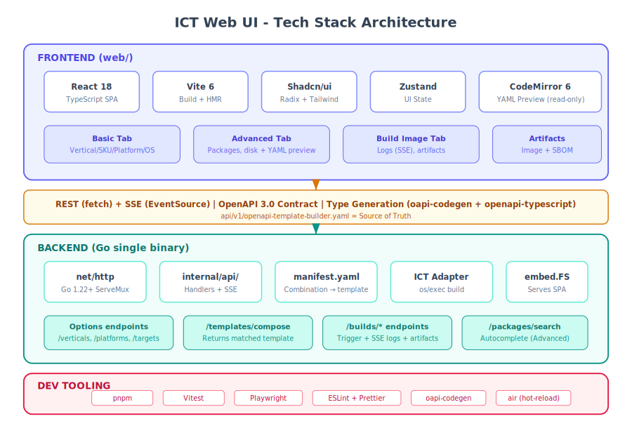
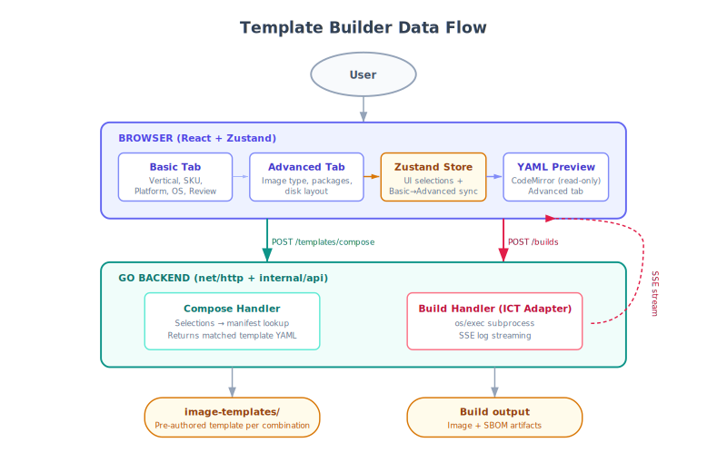
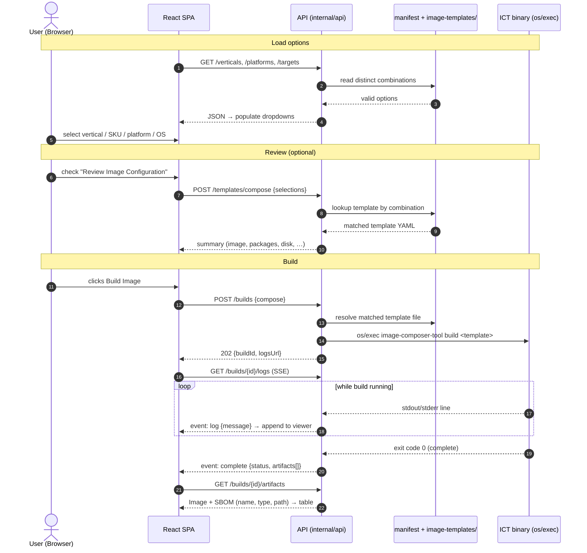
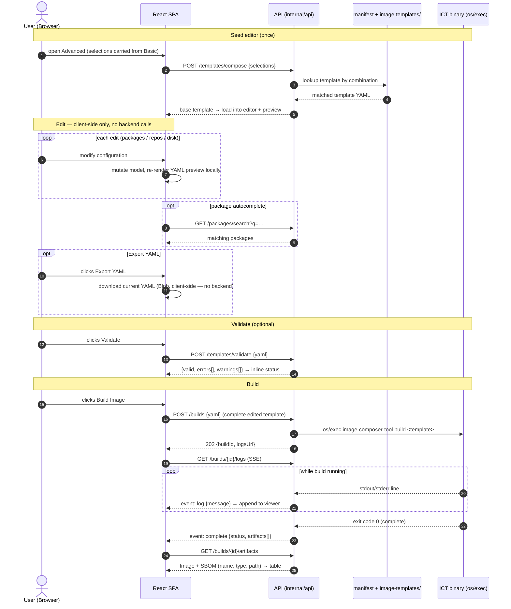

# ADR: Web UI and API Tech Stack

**Status**: Proposed  
**Date**: 2026-06-26  
**Updated**: 2026-06-28  
**Authors**: ICT Team  
**Technical Area**: Web Frontend, REST API, Developer Tooling  
**Related**: [OpenAPI Spec](../../api/v1/openapi-template-builder.yaml), [UI Prototype](../../web/prototype/template-builder.html)

---

## Summary

This ADR defines the technology stack for the ICT web-based template builder UI and its backing REST API. The interactive prototype at `web/prototype/template-builder.html` serves as the design reference — the production implementation will replicate its three-tab layout (Basic, Advanced, Build Image) using the stack defined here.

---

## Context

### Problem Statement

ICT needs a web interface that lets users compose image templates for different industry verticals and custom configurations. The UI must:

1. Provide a guided **Basic** flow where users pick a targeted vertical (Robotics, Physical AI, Agentic AI, Health, Fed Aero, Industrial IoT, Retail Edge, or Generic), SKU, platform (PTL/WCL/ARL/NVL), and OS — with vertical-specific defaults auto-applied
2. Provide an **Advanced** tab for power users to customize image type (RAW/ISO/QCOW), package repositories, packages, and disk/partition layout — with a live YAML preview
3. Provide a **Build Image** tab that streams build logs via SSE and lists output artifacts (Image + SBOM)
4. Be served from a single Go binary (one deployment artifact)

### Architecture Principles

- **Separate UI intent from ICT execution** — UI captures user intent in product language; backend translates to ICT templates
- **No YAML in Basic** — Basic tab uses product-level concepts only (verticals, SKUs, platforms)
- **YAML in Advanced** — power users get live YAML preview and export capability
- **Basic → Advanced sync** — switching from Basic to Advanced pre-populates all selections automatically

### Reference Prototype

The file `web/prototype/template-builder.html` demonstrates the exact views and interactions:

| Tab | Production Component | Key Interactions |
|-----|---------------------|------------------|
| **Basic** | `<BasicPage>` | Targeted Vertical dropdown (Generic + 7 verticals), SKU dropdown (vertical-specific), Platform dropdown (PTL/WCL/ARL/NVL), OS dropdown with "-- Select Operating System --" placeholder, "Review Image Configuration" checkbox expanding summary table (Image, Vertical, SKU, Platform, OS, Image Type, Disk, Packages). Any config change auto-unchecks review. |
| **Advanced** | `<AdvancedPage>` | Step wizard. MVP-1 steps: Target (same as Basic + Image Type/Name), Packages (repos + search/add), Disk (size/partitions), Review (summary + Validate + Export YAML + Build). Live YAML preview panel on right. More steps may be added later. |
| **Build Image** | `<BuildImagePage>` | Streaming log viewer (SSE) with "Build Status" title, artifacts table (Image + SBOM with copy-path icon) |

### Constraints

- **Single binary deployment**: The compiled React frontend (static HTML/JS/CSS from `web/dist/`) is embedded into the Go binary via `embed.FS` and served by the same process that serves the API. Shipping and running ICT means shipping and running one executable — no separate web server, container, or Node.js runtime is required at deploy time.
- **Existing Go stack**: reuse what ICT already depends on — `net/http`, `cobra`, `jsonschema/v5`, `zap`, `yaml.v3`.
- **Team expertise**: Go-primary team, moderate frontend experience.
- **Corporate proxy**: SSE (not WebSocket) for real-time streaming.

---

## Decision

### Architecture Diagram



### Data Flow Diagram



### Sequence Diagram — Basic flow

Basic is a pure lookup: selections → matched template → build. No YAML editing,
no client-side template model.



### Sequence Diagram — Advanced flow

Advanced fetches the base template once, then all editing, preview re-rendering,
and Export YAML happen **client-side**. Validate and Build send the complete YAML.



---

### Frontend Stack

| Layer | Choice | Maps to Prototype |
|-------|--------|-------------------|
| **Framework** | React 18 + TypeScript | Replaces vanilla DOM manipulation |
| **Build Tool** | Vite 6 | Builds `web/dist/` for embedding |
| **Component Library** | Shadcn/ui (Radix + Tailwind) | Replaces inline CSS controls (dropdowns, chips, cards) |
| **CSS** | Tailwind CSS 4 | Replaces CSS custom properties |
| **State Management** | Zustand | Replaces prototype's `state` object + re-render functions |
| **Form Validation** | Zod | Client-side mirror of backend JSON Schema |
| **HTTP Client** | Native `fetch` + `EventSource` | Replaces local logic with real API calls |
| **Icons** | Lucide React | Replaces HTML entities |

### Backend Stack (API Layer — Thin RESTful Service)

| Layer | Choice | Purpose |
|-------|--------|---------|
| **HTTP Router** | Go stdlib `net/http` (Go 1.22+ mux) | Method + pattern routing, zero dependencies |
| **Middleware** | Custom (CORS, logging, request-id) | Thin wrappers around stdlib |
| **Serialization** | `encoding/json` | Request/response marshalling |
| **Validation** | `santhosh-tekuri/jsonschema/v5` | Template validation (already in deps) |
| **YAML** | `yaml.v3` + `sigs.k8s.io/yaml` | Read/serve the matched template; parse the complete YAML sent by Advanced builds |
| **SSE Streaming** | Custom `text/event-stream` writer | Build log streaming to UI |
| **ICT Adapter** | `os/exec` subprocess | Translates intent to ICT calls, invokes `image-composer-tool build`, normalizes logs/artifacts |
| **Logging** | `go.uber.org/zap` | Structured logs |
| **Static Serving** | `embed.FS` + `http.FileServer` | Embeds frontend assets |
| **API Docs** | OpenAPI spec in repo (`api/v1/openapi-template-builder.yaml`) | Viewable on GitHub, rendered by GitHub's YAML viewer |

### Developer Tooling

| Tool | Purpose |
|------|---------|
| **pnpm** | Package manager |
| **Vitest** | Unit tests |
| **Playwright** | E2E tests |
| **ESLint + Prettier** | Lint + format |
| **oapi-codegen** | Go types from OpenAPI spec |
| **openapi-typescript** | TypeScript types from OpenAPI spec |
| **air** | Go hot-reload in development |

---

## Prototype-to-Production Mapping

### Basic Tab

| Prototype Feature | Production Implementation |
|-------------------|--------------------------|
| Targeted Vertical dropdown with optgroup | `<Select>` from Shadcn/ui, options from `GET /api/v1/verticals` |
| SKU dropdown (vertical-specific) | `<Select>`, options from `GET /api/v1/verticals/{id}/skus` |
| Platform dropdown (PTL/WCL/ARL/NVL) | `<Select>`, options from `GET /api/v1/platforms` |
| OS dropdown (per-vertical) | `<Select>`, options from the selected vertical's `supportedOs` (via `GET /api/v1/verticals`), preselecting `defaultOs`. MVP-1 has one OS per vertical; the list grows without UI changes. |
| "Review Image Configuration" checkbox | `<Checkbox>` + `<ReviewPanel>` — expands summary table |
| Review summary table | `<Table>` showing Image, Vertical, SKU, Platform, OS, Image Type, Disk, Packages — data from vertical presets via `GET /api/v1/verticals/{id}/defaults` |
| Auto-uncheck on config change | Zustand subscription resets review state on any selection change |
| "Build Image" button | Navigates to Build Image tab, triggers `POST /api/v1/builds` |
| "Edit in Advanced" button | Navigates to Advanced tab, syncs Basic state into Advanced store |

### Advanced Tab

| Prototype Feature | Production Implementation |
|-------------------|--------------------------|
| Step wizard with progress dots | `<Stepper>` component with Back/Next navigation (MVP-1: Target, Packages, Disk, Review; extensible) |
| Target step (mirrors Basic + Image Type/Name) | Same `<Select>` components as Basic + `<Select>` for Image Type + `<Input>` for Image Name |
| Packages step: repositories | `<CheckboxCard>` components, from `GET /api/v1/package-repos` |
| Packages step: search with autocomplete | `<Combobox>` with autocomplete from `GET /api/v1/packages/search` |
| Packages step: selected packages tags | `<TagInput>` for managing selected packages |
| Disk step: size + unit selector | `<Input>` + `<Select>` for unit |
| Disk step: partition table type | `<ToggleGroup>` (GPT) |
| Disk step: partition layout | `<Table>` with add/remove partition actions |
| Review step: summary table | `<Table>` matching Basic review (Image, Vertical, SKU, Platform, OS, Image Type, Disk, Packages) |
| Review step: Validate | `<Button>` → `POST /api/v1/templates/validate { yaml }`; shows `{ valid, errors[], warnings[] }` inline. Optional — build re-checks anyway |
| Review step: Export YAML | `<Button>` — downloads the current preview YAML via a client-side Blob (**no backend call**) |
| Review step: Build Image | Navigates to Build Image tab, triggers `POST /api/v1/builds` with the **complete edited YAML** (`{ yaml }`), not a delta |
| Live YAML preview (right panel) | `<CodeMirror>` read-only. Base template fetched **once** via `POST /templates/compose` on entering Advanced; every subsequent edit mutates the Zustand model and re-renders the YAML **client-side** — no per-change backend calls |
| Basic → Advanced sync | `syncBasicToAdvanced()` copies Zustand Basic store into Advanced store on tab switch |

### Build Image Tab

| Prototype Feature | Production Implementation |
|-------------------|--------------------------|
| "Build Status" log viewer | `<ScrollArea>` with `EventSource` on `GET /api/v1/builds/{id}/logs` |
| Build result indicator (Pass/Fail) | Status badge driven by SSE `complete` event |
| Artifacts table (Image + SBOM) | `<Table>` with Name, Type, Path columns — data from `GET /api/v1/builds/{id}/artifacts` |
| Copy path icon | `<Button>` with tooltip "Copy path", copies artifact path to clipboard |
| Copy logs / Download logs | `<Button>` actions on log content |

---

## Key Technical Decisions

### Why stdlib `net/http` over chi/gin/echo?

Go 1.22 added method + pattern routing. ICT has ~13 endpoints — stdlib is sufficient and avoids external router dependencies.

### Why React over HTMX?

While the Basic tab could work with HTMX, the Advanced tab requires rich client-side state (step wizard, package tag inputs, live YAML preview, Basic→Advanced sync). Consistency across tabs and future extensibility favor a single SPA approach.

### Why Shadcn/ui?

- Not a dependency (copy-paste) — no version lock-in
- Accessible by default (Radix WAI-ARIA)
- Tailwind-native — matches the prototype's utility-style CSS
- Small bundle — only ship what you use

### Why Zustand?

The template state (vertical selection + overrides from Advanced) maps cleanly to a single store. Zustand's 1.1 kB footprint and zero-boilerplate API match the prototype's simple `state` object pattern.

### Why SSE over WebSocket?

Build log streaming is unidirectional (server → client). SSE works through corporate proxies, has built-in auto-reconnect, and needs ~50 lines of Go.

---

## Project Structure

### Frontend (`web/`)

Key files only — the full component/handler breakdown will evolve during
implementation.

```
web/
├── prototype/template-builder.html   # Design reference (open in browser)
├── src/
│   ├── api/            # Generated types (from OpenAPI) + typed client
│   ├── components/     # basic/ · advanced/ · build/ views + Shadcn ui/ primitives
│   ├── stores/         # Zustand state (Basic + Advanced)
│   └── pages/          # BasicPage · AdvancedPage · BuildImagePage
├── package.json
└── vite.config.ts      # dist/ output is embedded into the Go binary
```

### Backend (`internal/api/`)

Key files only — handlers are grouped by resource and may be split/renamed as
the implementation matures.

```
internal/api/
├── server.go / router.go       # HTTP server + route registration
├── manifest.go + data/manifest.yaml  # Maps UI combination → template file + labels
├── handlers_*.go               # Verticals, platforms, targets, packages, compose, builds
└── sse.go                      # Build-log streaming
```

---

## Implementation Data Model & Maintenance

The backend follows ICT's existing model: **one complete, tested template file per
combination of Basic-UI selections**. There is no runtime merging or overlay logic —
each combination resolves to a single pre-authored template in the `image-templates/`
directory. The ICT engineering team owns these templates and updates them only after
thorough testing; the API never synthesizes a template from scratch.

This keeps the backend trivially simple (a lookup, not a compositor) and guarantees
that every image the UI can produce corresponds to a template that has been validated
by engineering.

### How selections map to a template

The Basic UI collects five selections — **OS, vertical, SKU, platform, image type** —
which together identify one template. A small **manifest** maps each valid
combination to a template file *by explicit reference*, so filenames are not derived
from the selections:

| Selection | Mapped template (`template:` in manifest) |
|-----------|-------------------------------------------|
| Ubuntu 24.04 · Robotics · AMR · — · ISO | `ubuntu24-x86_64-robotics-jazzy-iso.yml` |
| Ubuntu 24.04 · Generic · Non-Realtime · PTL · RAW | `ubuntu24-x86_64-minimal-ptl-pv-raw.yml` |

> **No renaming required.** Existing templates in `image-templates/` keep their
> current filenames. The manifest's `template:` field points at whatever the file is
> already called, so the UI mapping and the on-disk names stay fully decoupled — any
> naming scheme (existing or future) works without touching the UI or API code.

The manifest maps each combination to its template file plus the display metadata the
UI needs (vertical/SKU/platform/OS labels, image type). It is the only new data
artifact; the templates themselves already exist.

### Data layout

```
image-templates/                     # Existing — one tested template per combination
├── ubuntu24-x86_64-robotics-jazzy-iso.yml
├── ubuntu24-x86_64-minimal-ptl-pv-raw.yml
└── ...

internal/api/data/
└── manifest.yaml                    # New — maps UI combinations → template file + labels
```

Example `manifest.yaml` entry:

```yaml
combinations:
  - vertical: robotics
    sku: amr
    platform: null            # platform-agnostic template
    os: ubuntu24
    imageType: iso
    template: ubuntu24-x86_64-robotics-jazzy-iso.yml
```

### What each endpoint returns

| Endpoint | Source |
|----------|--------|
| `GET /verticals`, `/platforms`, `/targets`, `/verticals/{id}/skus` | Distinct values from `manifest.yaml` (drives the dropdowns; only combinations that resolve to a real template are offered) |
| `GET /verticals/{id}/defaults` | The matched template — summary fields (packages, disk, image type) are read from that template file |
| `POST /templates/compose` | Returns the matched template's YAML verbatim — Basic uses it for the Review summary; Advanced fetches it **once** to seed the editor |
| `POST /templates/validate` | Validates the Advanced tab's edited YAML against the ICT schema; returns `{ valid, errors[], warnings[] }`. Backs the Validate button |
| `POST /builds` | **Basic:** `{ compose }` → builds the matched template file directly. **Advanced:** `{ yaml }` → builds the complete edited YAML sent by the client. Always a whole template, never a delta. |

### Maintenance (owned by ICT engineering)

| Change | Action |
|--------|--------|
| Add/adjust a combination's image content | Edit the corresponding `image-templates/*.yml` (after testing), commit |
| Add a new combination | Author + test a new template, add one `manifest.yaml` entry |
| Add an OS/SKU/platform to a vertical | Author the template(s) for the new combination, add manifest entries |

Because the dropdown options are derived from the manifest, the UI can only ever offer
combinations that have a tested template behind them — invalid selections are
impossible to construct.

### Advanced tab

The Advanced tab starts from the matched template (via Basic → Advanced sync) and lets
power users adjust packages, repositories, and disk layout on top of it.

**Editing is entirely client-side.** The base template is fetched **once** (`POST
/templates/compose`) when the user enters Advanced. Every subsequent edit mutates the
in-browser Zustand model, and the live YAML preview re-renders locally — there are **no
per-change backend round-trips**. At build time the browser sends the **complete edited
YAML** to `POST /builds { yaml }` (not a diff), so the preview the user sees is exactly
what gets built.

These edits produce a modified YAML for that build only; they do **not** alter the
stored templates. Changing a default template remains an engineering-team action.

> **Out of scope for MVP-1:** a live package index. `GET /packages/search` is backed by
> a static/sample package list in MVP-1; wiring it to real repository metadata
> (apt/dnf indices) is future work.

---

## Build & Development Workflow

### Development

```bash
# Terminal 1: Go API with hot-reload
air

# Terminal 2: Vite dev server (proxies /api/* to Go)
cd web && pnpm dev
```

### Production Build

```bash
cd web && pnpm build
go build -o image-composer-tool ./cmd/image-composer-tool
```

### Type Generation

Each endpoint declares an `operationId` (e.g. `listVerticals`, `composeTemplate`, `startBuild`), so generated Go and TypeScript client functions get stable, readable names.

```bash
oapi-codegen -generate types,client -o internal/api/types.gen.go api/v1/openapi-template-builder.yaml
npx openapi-typescript api/v1/openapi-template-builder.yaml -o web/src/api/types.ts
```

---

## Alternatives Considered

| Alternative | Reason Rejected |
|-------------|-----------------|
| HTMX + Go templates | Advanced tab needs client-side state (step wizard, tag inputs, live YAML preview) |
| Vue 3 + Vuetify | Smaller ecosystem, opinionated Material styling |
| chi/gin router | stdlib Go 1.22+ mux sufficient for ~12 endpoints |
| WebSocket for streaming | Blocked by corporate proxies, bidirectional not needed |
| Separate nginx for static | embed.FS gives single-binary deployment |

---

## Consequences

### Benefits

1. **Single binary**: `go build` produces one artifact with UI + API
2. **Type-safe end-to-end**: OpenAPI generates both Go and TypeScript types
3. **Proven UX**: Production mirrors the validated prototype exactly
4. **Vertical-first UX**: Non-expert users pick a vertical and get working defaults — 4 dropdowns + Build
5. **Seamless escalation**: Basic → Advanced carries all selections forward, no re-entry
6. **SBOM output**: Every build produces both an image and a software bill of materials

### Trade-offs

1. **Two build steps** (Vite + Go) — mitigated by `make build`
2. **Node.js in CI** — common in modern pipelines
3. **embed.FS adds ~2-5 MB** to binary — acceptable

### Risks

1. **Frontend skill gap** — mitigated by React + Shadcn (copy-paste, good docs) + prototype as reference
2. **Manifest/template drift** — each UI combination maps to a tested template in `image-templates/` via `manifest.yaml`; CI validates that every manifest entry points to an existing template file. Templates change only through engineering review. See [Implementation Data Model & Maintenance](#implementation-data-model--maintenance).
3. **YAML preview fidelity** — client-side YAML generation must match ICT template schema exactly

---

## References

- [Go 1.22 Enhanced ServeMux](https://go.dev/blog/routing-enhancements)
- [Vite](https://vite.dev/)
- [Shadcn/ui](https://ui.shadcn.com/)
- [CodeMirror 6](https://codemirror.net/)
- [Zustand](https://zustand-demo.pmnd.rs/)
- [oapi-codegen](https://github.com/oapi-codegen/oapi-codegen)

---

## Revision History

| Date | Author | Change |
|------|--------|--------|
| 2026-06-26 | ICT Team | Initial proposal — Basic/Advanced/Build MVP |
| 2026-06-28 | ICT Team | Updated to match prototype: renamed Build→Build Image, IMG→QCOW, removed kernel/users/policies/unattended steps, removed info cards/progress bar/build history, added Review Image Configuration checkbox, added artifacts table (Image+SBOM), added Basic→Advanced sync, reordered steps (Target→Packages→Disk→Review), updated API endpoints and project structure |
| 2026-06-28 | ICT Team | Editorial cleanup; OpenAPI spec rewritten to 12 endpoints with `operationId`s for codegen; removed embedded Swagger UI in favor of spec-in-repo |
| 2026-06-28 | ICT Team | Basic tab OS dropdown now per-vertical (`supportedOs`/`defaultOs`), future-proofed for multiple OSes per vertical; added `os` query param to `getVerticalDefaults`; documented Backend Data Model & Maintenance (catalog + defaults resolution + CI validation) |
| 2026-06-28 | ICT Team | Replaced catalog/overlay data model with ICT's template-per-combination model: each UI selection maps via `manifest.yaml` to one pre-authored, engineering-tested template in `image-templates/`; `compose` returns the matched template rather than synthesizing one; Advanced edits apply per-request only |
| 2026-07-01 | ICT Team | Refreshed both architecture diagrams to match current model (removed Swagger/validate/CRUD/policies/history; added manifest + artifacts); noted Advanced wizard steps are MVP-1 scope; clarified single-binary constraint; trimmed Project Structure to key files |
| 2026-07-01 | ICT Team | Renamed "Backend Data Model & Maintenance" → "Implementation Data Model & Maintenance"; added sequence diagram (API calls & ICT binary invocation over `os/exec` with SSE log streaming) |
| 2026-07-01 | ICT Team | Converted sequence diagram to Mermaid (repo convention for sequence diagrams); recolored block diagrams with a softer palette; renamed hand-authored SVGs from `*.drawio.svg` to `*.svg` (they are not draw.io-editable) |
| 2026-07-01 | ICT Team | Clarified build payload & Advanced preview: `POST /builds` is always self-contained (Basic → `{compose}`, Advanced → complete `{yaml}`, never a delta); Advanced fetches the base template once then edits/re-render happen client-side with no per-change backend calls; removed misleading "apply edits per request" wording |
| 2026-07-01 | ICT Team | Enforced exactly-one `compose`/`yaml` on `POST /builds` via `oneOf`; split the sequence diagram into separate Basic and Advanced flows; added `POST /templates/validate` endpoint to back the Advanced Validate button; documented Export YAML as a client-side action (no backend call) |
