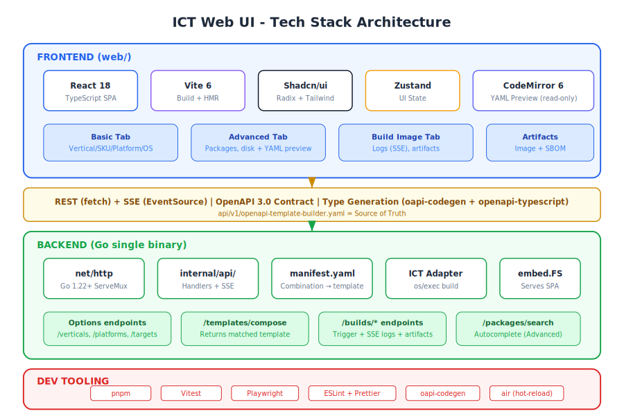
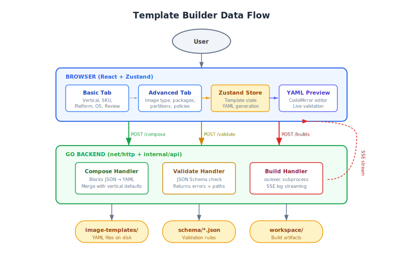

# ADR: Web UI and API Tech Stack

**Status**: Proposed  
**Date**: 2026-06-26  
**Updated**: 2026-06-28  
**Authors**: ICT Team  
**Technical Area**: Web Frontend, REST API, Developer Tooling  
**Related**: [OpenAPI Spec](../../api/v1/openapi-template-builder.yaml), [UI Prototype](../../web/prototype/template-builder.html)

---

## Summary

This ADR defines the technology stack for the ICT web-based template builder UI and its backing REST API. The interactive prototype at `web/prototype/template-builder.html` serves as the design reference — the production implementation will replicate its three-tab layout (Basic, Advanced, Build Image) using the stack defined here.

---

## Context

### Problem Statement

ICT needs a web interface that allows users to compose image templates for different industry verticals and custom configurations. The UI must:

1. Provide a guided **Basic** flow where users select a targeted vertical (Robotics, Physical AI, Agentic AI, Health, Fed Aero, Industrial IoT, Retail Edge, or Generic), then pick SKU, platform (PTL/WCL/ARL/NVL), and OS — with vertical-specific defaults auto-applied
2. Provide an **Advanced** tab for power users to customize image type (RAW/ISO/QCOW), manage package repositories, search/select packages, and configure disk/partition layout — with live YAML preview
3. Provide a **Build Image** tab that streams build logs via SSE and displays output artifacts (Image + SBOM)
4. Stream build logs via Server-Sent Events (SSE)
5. Be served from the same Go binary (single deployment artifact)

### Architecture Principles

- **Separate UI intent from ICT execution** — UI captures user intent in product language; backend translates to ICT templates
- **No YAML in Basic** — Basic tab uses product-level concepts only (verticals, SKUs, platforms)
- **YAML in Advanced** — power users get live YAML preview and export capability
- **Basic → Advanced sync** — switching from Basic to Advanced pre-populates all selections automatically

### Reference Prototype

The file `web/prototype/template-builder.html` demonstrates the exact views and interactions:

| Tab | Production Component | Key Interactions |
|-----|---------------------|------------------|
| **Basic** | `<BasicPage>` | Targeted Vertical dropdown (Generic + 7 verticals), SKU dropdown (vertical-specific), Platform dropdown (PTL/WCL/ARL/NVL), OS dropdown with "-- Select Operating System --" placeholder, "Review Image Configuration" checkbox expanding summary table (Image, Vertical, SKU, Platform, OS, Image Type, Disk, Packages). Any config change auto-unchecks review. |
| **Advanced** | `<AdvancedPage>` | 4-step wizard: Step 1 (Target — same as Basic + Image Type/Name), Step 2 (Packages — repos + search/add), Step 3 (Disk — size/partitions), Step 4 (Review — summary + Export YAML + Build). Live YAML preview panel on right. |
| **Build Image** | `<BuildImagePage>` | Streaming log viewer (SSE) with "Build Status" title, artifacts table (Image + SBOM with copy-path icon) |

### Constraints

- **Single binary deployment**: Frontend embedded via Go's `embed.FS`.
- **Existing Go stack**: `net/http`, `cobra`, `jsonschema/v5`, `zap`, `yaml.v3`.
- **Team expertise**: Go-primary team, moderate frontend experience.
- **Corporate proxy**: SSE (not WebSocket) for real-time streaming.

---

## Decision

### Architecture Diagram



### Data Flow Diagram



---

### Frontend Stack

| Layer | Choice | Maps to Prototype |
|-------|--------|-------------------|
| **Framework** | React 18 + TypeScript | Replaces vanilla DOM manipulation |
| **Build Tool** | Vite 6 | Builds `web/dist/` for embedding |
| **Component Library** | Shadcn/ui (Radix + Tailwind) | Replaces inline CSS controls (dropdowns, chips, cards) |
| **CSS** | Tailwind CSS 4 | Replaces CSS custom properties |
| **State Management** | Zustand | Replaces prototype's `state` object + re-render functions |
| **Form Validation** | Zod | Client-side mirror of backend JSON Schema |
| **HTTP Client** | Native `fetch` + `EventSource` | Replaces local logic with real API calls |
| **Icons** | Lucide React | Replaces HTML entities |

### Backend Stack (API Layer — Thin RESTful Service)

| Layer | Choice | Purpose |
|-------|--------|---------|
| **HTTP Router** | Go stdlib `net/http` (Go 1.22+ mux) | Method + pattern routing, zero dependencies |
| **Middleware** | Custom (CORS, logging, request-id) | Thin wrappers around stdlib |
| **Serialization** | `encoding/json` | Request/response marshalling |
| **Validation** | `santhosh-tekuri/jsonschema/v5` | Template validation (already in deps) |
| **YAML** | `yaml.v3` + `sigs.k8s.io/yaml` | Template parsing and merge with vertical defaults |
| **SSE Streaming** | Custom `text/event-stream` writer | Build log streaming to UI |
| **ICT Adapter** | `os/exec` subprocess | Translates intent to ICT calls, invokes `image-composer-tool build`, normalizes logs/artifacts |
| **Logging** | `go.uber.org/zap` | Structured logs |
| **Static Serving** | `embed.FS` + `http.FileServer` | Embeds frontend assets |
| **API Docs** | OpenAPI spec in repo (`api/v1/openapi-template-builder.yaml`) | Viewable on GitHub, rendered by GitHub's YAML viewer |

### Developer Tooling

| Tool | Purpose |
|------|---------|
| **pnpm** | Package manager |
| **Vitest** | Unit tests |
| **Playwright** | E2E tests |
| **ESLint + Prettier** | Lint + format |
| **oapi-codegen** | Go types from OpenAPI spec |
| **openapi-typescript** | TypeScript types from OpenAPI spec |
| **air** | Go hot-reload in development |

---

## Prototype-to-Production Mapping

### Basic Tab

| Prototype Feature | Production Implementation |
|-------------------|--------------------------|
| Targeted Vertical dropdown with optgroup | `<Select>` from Shadcn/ui, options from `GET /api/v1/verticals` |
| SKU dropdown (vertical-specific) | `<Select>`, options from `GET /api/v1/verticals/{id}/skus` |
| Platform dropdown (PTL/WCL/ARL/NVL) | `<Select>`, options from `GET /api/v1/platforms` |
| OS dropdown with placeholder | `<Select>`, options from `GET /api/v1/targets` |
| "Review Image Configuration" checkbox | `<Checkbox>` + `<ReviewPanel>` — expands summary table |
| Review summary table | `<Table>` showing Image, Vertical, SKU, Platform, OS, Image Type, Disk, Packages — data from vertical presets via `GET /api/v1/verticals/{id}/defaults` |
| Auto-uncheck on config change | Zustand subscription resets review state on any selection change |
| "Build Image" button | Navigates to Build Image tab, triggers `POST /api/v1/builds` |
| "Edit in Advanced" button | Navigates to Advanced tab, syncs Basic state into Advanced store |

### Advanced Tab

| Prototype Feature | Production Implementation |
|-------------------|--------------------------|
| Step wizard with progress dots | `<Stepper>` component, 4 steps with Back/Next navigation |
| Step 1: Target (mirrors Basic + Image Type/Name) | Same `<Select>` components as Basic + `<Select>` for Image Type + `<Input>` for Image Name |
| Step 2: Package repositories | `<CheckboxCard>` components, from `GET /api/v1/package-repos` |
| Step 2: Package search with autocomplete | `<Combobox>` with autocomplete from `GET /api/v1/packages/search` |
| Step 2: Selected packages tags | `<TagInput>` for managing selected packages |
| Step 3: Disk size + unit selector | `<Input>` + `<Select>` for unit |
| Step 3: Partition table type | `<ToggleGroup>` (GPT) |
| Step 3: Partition layout | `<Table>` with add/remove partition actions |
| Step 4: Review summary table | `<Table>` matching Basic review (Image, Vertical, SKU, Platform, OS, Image Type, Disk, Packages) |
| Step 4: Export YAML | `<Button>` generates and downloads `.yml` file |
| Step 4: Build Image | Navigates to Build Image tab, triggers `POST /api/v1/builds` |
| Live YAML preview (right panel) | `<CodeMirror>` read-only with YAML mode, updates on every state change via Zustand |
| Basic → Advanced sync | `syncBasicToAdvanced()` copies Zustand Basic store into Advanced store on tab switch |

### Build Image Tab

| Prototype Feature | Production Implementation |
|-------------------|--------------------------|
| "Build Status" log viewer | `<ScrollArea>` with `EventSource` on `GET /api/v1/builds/{id}/logs` |
| Build result indicator (Pass/Fail) | Status badge driven by SSE `complete` event |
| Artifacts table (Image + SBOM) | `<Table>` with Name, Type, Path columns — data from `GET /api/v1/builds/{id}/artifacts` |
| Copy path icon | `<Button>` with tooltip "Copy path", copies artifact path to clipboard |
| Copy logs / Download logs | `<Button>` actions on log content |

---

## Key Technical Decisions

### Why stdlib `net/http` over chi/gin/echo?

Go 1.22 added method + pattern routing. ICT has ~15 endpoints — stdlib is sufficient and avoids external router dependencies.

### Why React over HTMX?

While the Basic tab could work with HTMX, the Advanced tab requires rich client-side state (step wizard, package tag inputs, live YAML preview, Basic→Advanced sync). Consistency across tabs and future extensibility favor a single SPA approach.

### Why Shadcn/ui?

- Not a dependency (copy-paste) — no version lock-in
- Accessible by default (Radix WAI-ARIA)
- Tailwind-native — matches the prototype's utility-style CSS
- Small bundle — only ship what you use

### Why Zustand?

The template state (vertical selection + overrides from Advanced) maps cleanly to a single store. Zustand's 1.1 kB footprint and zero-boilerplate API match the prototype's simple `state` object pattern.

### Why SSE over WebSocket?

Build log streaming is unidirectional (server → client). SSE works through corporate proxies, has built-in auto-reconnect, and needs ~50 lines of Go.

---

## Project Structure

### Frontend (`web/`)

```
web/
├── prototype/
│   └── template-builder.html    # Design reference (open in browser)
├── src/
│   ├── main.tsx
│   ├── App.tsx
│   ├── api/
│   │   ├── types.ts             # Generated from OpenAPI spec
│   │   └── client.ts            # Typed fetch + EventSource
│   ├── components/
│   │   ├── ui/                  # Shadcn/ui primitives
│   │   ├── basic/
│   │   │   ├── VerticalSelect.tsx
│   │   │   ├── SkuSelect.tsx
│   │   │   ├── PlatformSelect.tsx
│   │   │   ├── OsSelect.tsx
│   │   │   └── ReviewPanel.tsx
│   │   ├── advanced/
│   │   │   ├── StepWizard.tsx
│   │   │   ├── TargetStep.tsx
│   │   │   ├── PackageRepoCards.tsx
│   │   │   ├── PackageSearch.tsx
│   │   │   ├── PackageTagInput.tsx
│   │   │   ├── DiskConfig.tsx
│   │   │   ├── PartitionTable.tsx
│   │   │   ├── ReviewStep.tsx
│   │   │   └── YamlPreview.tsx
│   │   ├── build/
│   │   │   ├── LogViewer.tsx
│   │   │   └── ArtifactsTable.tsx
│   │   └── layout/
│   │       └── AppShell.tsx
│   ├── stores/
│   │   ├── basic-store.ts
│   │   └── advanced-store.ts
│   ├── lib/
│   │   └── yaml.ts
│   └── pages/
│       ├── BasicPage.tsx
│       ├── AdvancedPage.tsx
│       └── BuildImagePage.tsx
├── package.json
├── vite.config.ts
└── dist/
```

### Backend (`internal/api/`)

```
internal/api/
├── server.go
├── router.go
├── middleware.go
├── handlers_verticals.go    # GET /verticals, /verticals/{id}/skus, /verticals/{id}/defaults
├── handlers_platforms.go    # GET /platforms
├── handlers_targets.go      # GET /targets (OS list)
├── handlers_packages.go     # GET /packages/search, GET /package-repos
├── handlers_templates.go    # POST /templates/compose (merge intent → YAML)
├── handlers_builds.go       # POST /builds, GET /builds/{id}/logs (SSE), GET /builds/{id}/artifacts
├── sse.go
└── errors.go
```

---

## Build & Development Workflow

### Development

```bash
# Terminal 1: Go API with hot-reload
air

# Terminal 2: Vite dev server (proxies /api/* to Go)
cd web && pnpm dev
```

### Production Build

```bash
cd web && pnpm build
go build -o image-composer-tool ./cmd/image-composer-tool
```

### Type Generation

```bash
oapi-codegen -generate types -o internal/api/types.gen.go api/v1/openapi-template-builder.yaml
npx openapi-typescript api/v1/openapi-template-builder.yaml -o web/src/api/types.ts
```

---

## Alternatives Considered

| Alternative | Reason Rejected |
|-------------|-----------------|
| HTMX + Go templates | Advanced tab needs client-side state (step wizard, tag inputs, live YAML preview) |
| Vue 3 + Vuetify | Smaller ecosystem, opinionated Material styling |
| chi/gin router | stdlib Go 1.22+ mux sufficient for ~12 endpoints |
| WebSocket for streaming | Blocked by corporate proxies, bidirectional not needed |
| Separate nginx for static | embed.FS gives single-binary deployment |

---

## Consequences

### Benefits

1. **Single binary**: `go build` produces one artifact with UI + API + Swagger docs
2. **Type-safe end-to-end**: OpenAPI generates both Go and TypeScript types
3. **Proven UX**: Production mirrors the validated prototype exactly
4. **Vertical-first UX**: Non-expert users select a vertical and get working defaults — 4 dropdowns + Build
5. **Seamless escalation**: Basic → Advanced carries all selections forward, no re-entry
6. **SBOM output**: Every build produces both image and software bill of materials

### Trade-offs

1. **Two build steps** (Vite + Go) — mitigated by `make build`
2. **Node.js in CI** — common in modern pipelines
3. **embed.FS adds ~2-5 MB** to binary — acceptable

### Risks

1. **Frontend skill gap** — mitigated by React + Shadcn (copy-paste, good docs) + prototype as reference
2. **Vertical preset management** — must be maintained as new verticals/SKUs are added
3. **YAML preview fidelity** — client-side YAML generation must match ICT template schema exactly

---

## References

- [Go 1.22 Enhanced ServeMux](https://go.dev/blog/routing-enhancements)
- [Vite](https://vite.dev/)
- [Shadcn/ui](https://ui.shadcn.com/)
- [CodeMirror 6](https://codemirror.net/)
- [Zustand](https://zustand-demo.pmnd.rs/)
- [oapi-codegen](https://github.com/oapi-codegen/oapi-codegen)


---

## Revision History

| Date | Author | Change |
|------|--------|--------|
| 2026-06-26 | ICT Team | Initial proposal — Basic/Advanced/Build MVP |
| 2026-06-28 | ICT Team | Updated to match prototype: renamed Build→Build Image, IMG→QCOW, removed kernel/users/policies/unattended steps, removed info cards/progress bar/build history, added Review Image Configuration checkbox, added artifacts table (Image+SBOM), added Basic→Advanced sync, reordered steps (Target→Packages→Disk→Review), updated API endpoints and project structure |
