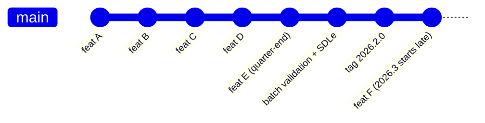
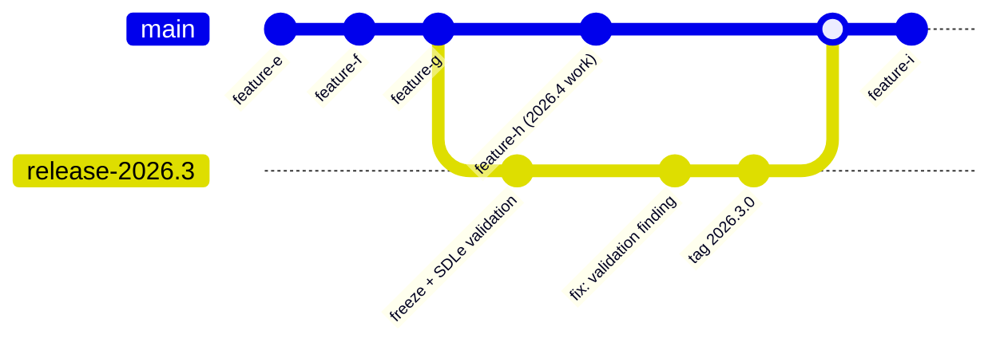

## Context

### Current practice

New features are merged to `main` via PR throughout the quarter. Validation and SDLe checks are run as a batch at the end of the quarter, followed by a release tag.

### Question under consideration

Should we instead develop features in an internal innersource repository for the quarter, and only "port" the accumulated work into the public `main` branch after validation/SDLe passes, tagging a release at that point?

### Key risks with the internal-first / quarterly drop model

1. A public repo with no commits for a quarter looks abandoned to anyone evaluating or depending on it, hurting adoption and credibility of the OSS project.
2. Deferring all integration, linting, security scanning (Trivy/Gitleaks/Zizmor), and test coverage checks to one end-of-quarter merge means problems compound and surface late, right before a release deadline — the opposite of "shift left."

---

## Decision

### 1. Develop upstream-first on public `main`

- All feature work lands on public `main` via normal PRs, continuously through the quarter — not batched.
- Every PR runs the full automated gate: `earthly +test`, `earthly +lint`, Trivy, Gitleaks, Zizmor, coverage threshold.
- Incomplete or experimental features land behind provider-level scoping or are simply not wired into default templates until ready — no need to hide the code itself.

### 2. Cut a release branch near quarter-end for validation, not a repo merge

- 2–3 weeks before quarter-end, branch `release-2026.3` from `main`.
- Run the full validation cycle and SDLe sign-off against that branch, not against a private mirror.
- Only release-blocking fixes are cherry-picked into `release-2026.3`; `main` keeps moving for the next quarter's (2026.4) work.
- Tag `2026.3.0` on the release branch once sign-off completes; merge any release-branch-only fixes back to `main`.

### 3. Reserve a private/internal mirror for embargoed work only

Use an internal repository only when the code itself cannot be public yet:

- Unannounced/pre-silicon hardware support.
- Security fixes pending coordinated disclosure.

For this narrow case: rebase on public `main` at least weekly and land in small PRs mirroring the eventual public change, rather than accumulating a quarter of drift and squash-merging at the end.

---

## Consequences

**Benefits**

- `main` stays active and demonstrably maintained for anyone evaluating the OSS project.
- Validation/security findings surface incrementally (per-PR), not all at once against a release deadline.
- No large, hard-to-review diffs; `git blame`/`bisect` remain useful.
- Release branch isolates the validation window without blocking ongoing development.

**Trade-offs**

- Requires discipline to keep feature work reasonably small and mergeable.
- Release-branch cherry-picks need light process (label PRs as release-blocking) to avoid drift.
