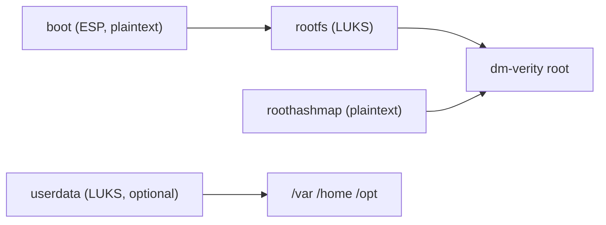

# Configure Full-Disk Encryption (FDE)

This guide walks you through enabling full-disk encryption (FDE) for your target
OS image using ICT. ICT encrypts the partitions you select with LUKS2 during the
image build, and the encrypted volumes are unlocked at boot.

## Prerequisites

- Linux environment
- ICT tool configured
- A `raw` image template (`target.imageType: raw`) with defined disk partitions
- `cryptsetup-bin` in the package list (present in the default OS package sets)
- Basic understanding of [Image Templates](../architecture/image-composer-tool-templates.md)
  and your image's partition IDs

## How It Works

FDE is applied in two phases:

- **Build time:** After the OS is installed, ICT encrypts each selected partition
  in place with LUKS2 (using `cryptsetup reencrypt`), reopens it as a
  `/dev/mapper/<id>` device, and continues the build against the decrypted
  volume.
- **Boot time:** ICT wires the boot configuration so the encrypted volumes are
  unlocked. The root volume is unlocked from the kernel command line
  (`rd.luks.*`); additional volumes are unlocked from `/etc/crypttab`.

## Configuration Structure

The `fde` section is placed under `systemConfig` in your image template YAML
file, alongside other system configuration options:

```yaml
systemConfig:
  name: my-image
  # ... other system configuration
  fde:
    enabled: true
    passphraseFile: "/path/to/fde-passphrase.txt"
    unlock: auto
    partitions:
      - rootfs
```

## Field Reference

| Field | Type | Required | Description |
|-------|------|----------|-------------|
| `enabled` | bool | **Yes** | Enable full-disk encryption. Default: `false`. |
| `passphraseFile` | string | **Yes** (when `enabled: true`) | Absolute or template-relative local file path containing passphrase material. File must be non-empty. |
| `partitions` | string[] | No | Disk partition IDs to encrypt (for example `rootfs`, `userdata`). If omitted, only the partition with `mountPoint: /` (typically `rootfs`) is encrypted. |
| `unlock` | string | No | Boot unlock mode: `auto` (default) or `manual`. See [Unlock Modes](#unlock-modes). |

The partition IDs must exist in the merged disk configuration (OS defaults plus
your template). The ESP (`boot`) is never encrypted, and dm-verity hash
partitions must stay plaintext (see below).

## Example: FDE Only

A minimal FDE template encrypts the root filesystem:

```yaml
systemConfig:
  name: edge
  fde:
    enabled: true
    passphraseFile: "/run/secrets/fde-passphrase.txt"
    unlock: auto
    partitions:
      - rootfs

  packages:
    - ubuntu-minimal
    - systemd-boot
    - dracut-core
    - systemd
    - cryptsetup-bin
```

See [`image-templates/ubuntu24-x86_64-fde.yml`](../../../image-templates/ubuntu24-x86_64-fde.yml)
for a complete working example.

## Example: FDE with Immutability (dm-verity)

FDE can coexist with the dm-verity immutable root (see
[Configure Secure Boot](configure-secure-boot.md) for the related Secure Boot
setup). In this mode LUKS is opened first, then dm-verity runs over the
decrypted mapper.

The default raw layout contains a plaintext ESP, the root filesystem, a verity
hash partition, and a mutable data partition:



To encrypt both the root and the mutable data partition:

```yaml
systemConfig:
  name: edge
  immutability:
    enabled: true
  fde:
    enabled: true
    passphraseFile: "/run/secrets/fde-passphrase.txt"
    unlock: manual
    partitions:
      - rootfs
      - userdata
```

Key rules for FDE with immutability:

- Encrypt `rootfs` (required to protect the root) and `userdata` when you want
  the mutable state (`/var`, `/home`, `/opt`) encrypted as well.
- **Do not** list `roothashmap` (or any hash partition with `mountPoint: none`)
  under `fde.partitions`. It must stay plaintext for the verity `roothash=`
  parameter; encrypting it results in a boot into emergency mode.
- At runtime the order is: LUKS opens the root, dm-verity stacks on
  `/dev/mapper/rootfs`, and any additional volumes (such as `userdata`) are
  unlocked from `/etc/crypttab`.

## Unlock Modes

| Mode | Boot experience | Security note |
|------|-----------------|----------------|
| `auto` (default) | No prompt. A shared keyfile at `/etc/cryptsetup-keys.d/fde.key` (containing the passphrase material) is embedded in the initramfs so volumes unlock automatically. | Convenient, but the secret ships on the ESP/initramfs, so this is not strong confidentiality against an attacker with physical access. |
| `manual` | The passphrase is entered interactively at boot. The root volume prompts via `rd.luks.*`; additional partitions may prompt separately via crypttab. | The passphrase is not stored in the initramfs. Expect one prompt per encrypted volume. |

When `auto` unlock adds the keyfile, the passphrase keyslot is retained as a
fallback, so you can still unlock interactively for recovery.

## Validate and Build

Validate the template before building:

```bash
image-composer-tool validate your-template.yml
```

Then build the image as usual. Validation fails if `fde.enabled` is `true` but
no non-empty `passphraseFile` is provided.

## Verify on the Device

After booting, confirm the selected partitions are encrypted with `lsblk`. Each
encrypted partition ID appears as a `crypt` mapper, while the ESP and any verity
hash partition remain plaintext:

```bash
lsblk
```

```text
sda
├─sda1                    part  /boot/efi
├─sda2                    part
│ └─rootfs   252:0    crypt
│   └─root   252:1    crypt /
├─sda3                    part          # roothashmap (plaintext)
└─sda4                    part
  └─userdata 252:2    crypt /opt        # only if listed in fde.partitions
```

In `manual` mode, expect one passphrase prompt per encrypted volume.

## Security Best Practices

1. Never commit real passphrases to version control. Use a placeholder in the
  template path only, and provide the real secret in a local file during build.
2. Prefer `manual` unlock when a stronger boot policy is required; the passphrase
   is not embedded in the image.
3. Treat `auto` unlock as a convenience feature: the keyfile lives on the ESP and
   in the initramfs, so it does not protect against physical extraction.
4. Plan for recovery: the passphrase keyslot is kept as a fallback even in `auto`
   mode.

> **Note:** When ICT logs the merged template at debug level, the
> `systemConfig.fde.passphraseFile` and resolved passphrase values are redacted as `[REDACTED]`, so they do not
> leak into build logs.

## Limitations

- FDE applies to `raw` images with defined `disk.partitions` IDs.
- The in-place reencryption path currently supports **ext4** filesystems only.
- The ESP (`boot`) is not encrypted by design.

## Troubleshooting

**Common Issues:**

1. **Validation error about a missing passphrase file:** Set a non-empty
  `passphraseFile` when `fde.enabled` is `true`.
2. **Build fails with "partition has no device in the disk map":** The partition
   ID under `fde.partitions` does not exist in the merged disk configuration.
   Use IDs from the disk layout (for example `rootfs`, `userdata`).
3. **Boot drops into emergency mode with immutability:** Make sure the verity
   hash partition (`roothashmap`) is **not** listed under `fde.partitions`.
4. **Data partition is still unencrypted:** With immutability, the mutable
   `userdata` partition is only encrypted when you add it explicitly to
   `fde.partitions`.

## Related Documentation

- [Image Templates](../architecture/image-composer-tool-templates.md)
- [Understanding the OS Image Build Process](../architecture/image-composer-tool-build-process.md)
- [Configure Secure Boot](configure-secure-boot.md)
- Sample template: [`image-templates/ubuntu24-x86_64-fde.yml`](../../../image-templates/ubuntu24-x86_64-fde.yml)
